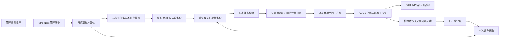
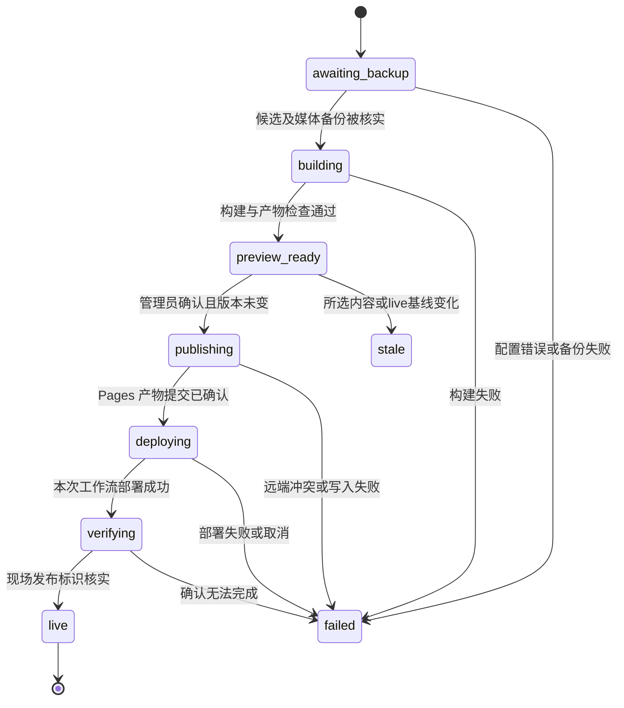

# 观澜志最终博客第一版开发文档（供 AI 实施）

> **文档状态：开发规格与实施计划，不是已完成报告。**
>
> 本文根据截至 2026-09-30 的完整需求讨论、[讨论汇总](../../最终博客项目讨论汇总.md)以及两个源项目的只读源码核查编写；同日根据审查结果补齐发布门槛、部署重试、预览安全和恢复兼容契约。本轮仅优化文档，没有构建最终应用、调整真实 App 权限或部署新站。
>
> **面向执行 AI：** 先读本文件、根目录 `AGENTS.md`、存在时的 `memory.md` 及讨论汇总，再实施。若使用子代理，可采用 `subagent-driven-development` 逐任务实现；任务与验收用复选框跟踪。不要把“阅读并执行本文”理解为允许删除旧项目、改写 Git 历史、注册外部应用或任意部署。

**目标：** 保留用户满意的 `blog-nevigation` 界面，在新目录完成可在线管理、独立 GitHub 备份、构建预览、按范围发布到 GitHub Pages、按用户选择合并恢复的第一版；核心链路验收通过后上线。

**架构：** 单个 Next.js 管理服务、单实例文件任务执行器、同仓库内隔离的公开站静态构建入口。草稿、发布候选快照、已上线快照分离。GitHub App 连接两个用途不同的仓库；Pages 只接收确认过的静态产物。

**技术栈：** 沿用 React 18、Next.js 15、TypeScript strict、Tailwind CSS、npm、Vitest、Node.js 24、Docker 和现有 JSON/媒体文件存储。具体核查版本见 §3；不为此项目改用 Vue、Astro、Tauri、数据库或 Redis。

**规格来源与优先级：** 用户最新明确决定 > 根目录 `AGENTS.md` > 讨论汇总 > 本文的实现建议。本文标为“实现约定”的内容是为减少反复提问而选定的工程默认值，可以因可复现的技术障碍调整，但不能改变已确认的产品行为。

**阅读约定：** §4–§10 定义行为与接口契约，§11 定义实施任务，§13 定义观察结果；任务表和验收矩阵引用契约，不重新定义规则。后续改动应同步对应任务与测试，明确区分必须满足的行为、工程默认值和尚未实测的外部条件。

---

## 0. 执行者先读：范围与禁止事项

### 0.1 三个本地目录

| 目录 | 角色 | 允许的操作 |
| --- | --- | --- |
| `D:\PROJECT_ZZZZZZZZZ\博客项目最终版本` | 唯一的新项目工作目录 | 在这里实现、测试和维护文档。保留已有规则、汇总和 `public/` 标识资产。 |
| `D:\PROJECT_ZZZZZZZZZ\blog-nevigation` | 界面、管理功能和内容基底 | 读取、选择性复制源码；不修改其运行时数据、配置或工作区。 |
| `D:\PROJECT_ZZZZZZZZZ\博客管理` | 已弃用的 Astro 站点与 Tauri 软件 | 只复用用户指定的标识图和编辑交互思路。禁止沿用其旧界面或复制整套软件。 |

不要把新项目建回两个源目录。旧 `博客管理` 工作树存在未提交改动，不得 `reset`、`clean` 或覆盖。新项目原先不是 Git 仓库；后续可在新目录初始化并关联已创建的源码仓库，但不得继承旧站提交历史或把现有文档覆盖掉。

### 0.2 权限与敏感数据边界

- 本次任务是文档交付。后续实施任务可以进行本地开发和隔离测试；真实 VPS 的地址、资源、登录方式和部署权限目前没有提供，不要假装已经有这些信息。
- GitHub 仓库已创建不等于 GitHub App 已注册、安装或配置成功。开发验收区分模拟测试、测试仓库实测与正式上线。
- 真实凭据不能写入本文、日志、示例、测试夹具、公开源码、Pages 产物或内容备份。不要把本机 `gh` 的 OAuth 凭据当成应用运行凭据。
- 自动提交、推送源码、修改生产配置不因本文而获得泛化授权；沿用会话已有授权边界，需新增对外操作时先产出具体可审核结果。
- 用户已取消删除仓库和清除 Git 历史。不要再申请 `delete_repo`，不要重新删除或重建 Pages 仓库。
- 当前明确要求公网 HTTP 5678、暂无 HTTPS、无需 SSH 隧道完成配置。只记录一次已知传输风险，不再以此反复阻塞需求讨论；认证、CSRF、输入校验、日志脱敏仍须保留。
- 根规则中“真实媒体不得进入公开产物”应按内容授权理解：未发布或无关媒体不能进入；用户明确发布的文章图片必须随 Pages 提供，否则违背已确认需求。公开源码不保存运行时媒体库。

### 0.3 已被后续决定替换的旧意见

1. 不做桌面写作软件；改为 VPS 在线管理。
2. 不把完整 Next 管理应用部署到 GitHub Pages；Pages 是静态公开站。
3. 不再清除旧 Pages 历史；已正常提交替换旧站当前文件。
4. 首期不做 HTTPS、备用入口、多管理员或可交互的公开图表。
5. 恢复不是整站直接覆盖，而是合并并让用户解决冲突。
6. 首次上线不等待全部图表、封面和编辑增强；这些最终需求保留到二期。

## 1. 第一版范围与上线门槛

### 1.1 第一版必须完成

| 编号 | 可观察的结果 | 最低验收依据 |
| --- | --- | --- |
| R01 | 新目录继承 `blog-nevigation` 的界面、布局、配色、导航与现有编辑能力；换入原「观澜」标识 | 桌面和手机实际界面对照；五个标识文件校验 |
| R02 | 示例文章沿用导航项目；导航分类、条目沿用现有内容；不存在的数据不编造 | 种子/导入清单；源文件不被写回 |
| R03 | 保存只改变草稿，文章按篇、导航整体、站点设置整体分别发布 | A/B 两篇交叉编辑测试；公开快照不带其他草稿 |
| R04 | 登录后的引导页配置 GitHub App，并验证 Pages/私有备份两个仓库 | 私钥脱敏、安装仓库检查、权限/网络错误可见 |
| R05 | 保存版本进入独立私有备份；文本可读、媒体可恢复；断网可保存和重试 | 快照完整性校验、持久化任务重启恢复 |
| R06 | 所有已保存内容的 GitHub 备份门槛与候选完整备份证明同时满足才允许发布；可查看历史并恢复成草稿 | §6.4 全局门槛；A候选已备份但B新保存待备份时阻断；历史恢复不触发上线 |
| R07 | 新服务器引导页列出备份、预览合并结果、逐项选冲突，再恢复 | 有现有数据、媒体重名、并发改动、中途失败夹具 |
| R08 | 生成完整静态公开站；预览与部署产物一致，预览请求绑定固定版本 | 同一产物摘要；匿名拒绝；旧标签页阻断；生产CSP下交互可用 |
| R09 | 只在匹配本次提交与运行尝试的 Pages 部署成功后显示已上线；明确失败可复跑 | 错误SHA/工作流/运行尝试、跳过、超时、崩溃及同提交复跑测试 |
| R10 | 撤回是独立操作；改标题不改网址；改网址留静态跳转；旧 `/blog/...` 链接有移除提示 | 路径冲突、跳转循环、撤回后资源清单验证 |
| R11 | 顶部全站搜索覆盖文章标题、摘要、标签、正文及导航；导航局部筛选保留 | 静态索引中文搜索；无 VPS 搜索请求；草稿不在索引 |
| R12 | RSS、sitemap、robots、分享元信息与无封面标题图从本次公开快照生成 | 静态文件、绝对 URL、编码与草稿泄漏测试 |
| R13 | GitHub 是主备份；R2 可选且旧明文 JSON 可读写 | 不配置 R2 也可完成引导/备份/发布；原 R2 回归 |
| R14 | Docker 单实例后台通过公网 5678 访问；先配置强口令再开放；更新保留数据 | 最终镜像内真实构建；HTTP 会话；更新/恢复实测 |

上表不是“所有最终功能已完成”的定义。仅全部 R01–R14 验收通过，才满足用户所说“核心闭环通过后先上线”。失败测试、仅存在按钮、仅成功推送 Git 提交均不算完成。

### 1.2 二期保留需求，不作为本次上线阻塞项

- 参考 doocs/md 的斜杠命令、右键菜单、统一格式命令、快捷键及表格交互增强；保留现有编辑器，不默认换 CodeMirror。
- 概率分布/直方图、饼柱折线图、流程/关系图：模板选择、表单填数据、可编辑代码、即时预览、发布为静态图；配一篇可修改示例文章。首期没有图表功能时不要先发布坏掉的图表示例。
- 可选文章封面：仅选后台媒体；文章开头和分享卡片使用，列表不变；无封面时标题分享图回退，文章不显示占位图。
- 更丰富的冲突差异界面、图表库选型细节、历史保留策略可配置、App 私钥轮换向导及针对测量热点的进一步优化。

二期不允许包含首期正确性基础：数据校验、任务重启恢复、备份一致性、基本冲突选择、发布隔离和真实部署核验必须在第一版完成。

### 1.3 当前真实状态

- 新目录已有 `AGENTS.md`、讨论汇总和五张标识图，尚无应用 `package.json` 或实现代码。
- 公开源码仓库：`guanlangzg/guanlangzg-blog`；私有备份仓库：`guanlangzg/guanlangzg-blog-backup`。会话中已创建，均只有初始化内容。
- Pages 仓库：`guanlangzg/guanlangzg.github.io`，正式网址 `https://guanlangzg.github.io`。
- 2026-09-30 已以普通提交 `8846548dc0d7eb0b28742b7b814855640348b07c` 替换 Pages 的 `main` 当前文件。对应运行 `36674112198` 部署成功，页面为“观澜志正在更新”。这是上次实测结果，执行上线前重新核对远端头，不能假定远端永远不变。
- 当前 Pages 树仅包含部署工作流及 `site/` 临时页和标识。旧历史、其他分支和 PR 记录保留。
- 未提供真实 VPS 配置，也未实测其到 GitHub 的网络、磁盘或内存。不要给出未经测量的上线耗时承诺。

## 2. 阅读地图与已核实代码事实

本节路径均相对于 `D:\PROJECT_ZZZZZZZZZ\blog-nevigation`，复制到新项目后保持可对应。这里只核查代码，没有执行该项目的完整测试套件。

| 领域 | 必读文件/目录 | 对实施的影响 |
| --- | --- | --- |
| 规则 | `AGENTS.md`、`memory.md` | 数据格式、R2 明文与 Docker 持久化不能被破坏；记忆里的开发默认口令不得迁入正式部署 |
| 依赖与命令 | `package.json`、`package-lock.json`、`.nvmrc`、`tsconfig.json`、`vitest.config.ts` | npm 工具链已存在；TypeScript 已开启 strict |
| 公共页面 | `src/app/page.tsx`、`blog/page.tsx`、`navigation/page.tsx`、`posts/[...slug]/page.tsx`、`layout.tsx` | 当前直接读运行时数据；需抽出视图和快照读取边界 |
| 公共组件与样式 | `src/app/components/`、`src/app/globals.css`、`src/app/styles/design-tokens.css`、`src/app/styles/markdown-preview.css` | 界面保留的基准；不要大面积重写样式 |
| Markdown/搜索 | `src/app/components/markdown/MarkdownContent.tsx`、`src/lib/markdown.ts`、`src/app/components/header/useCommandSearch.ts`、`src/app/api/search/route.ts` | 当前 Markdown 有净化与高亮；搜索有服务端依赖，需要静态适配 |
| 数据类型 | `src/app/types/article.ts`、`src/app/types/navigation.ts`、`src/lib/article-data.ts`、`src/lib/navigation-data.ts`、`src/lib/site-settings.ts` | 文章有 ID，导航条目没有稳定 ID；当前 status 不能作为上线证明 |
| 原子存储 | `src/lib/editor-data-storage.ts`、`atomic-json-writer.ts`、`json-revision.ts`、`runtime-data-lock.ts`、`manifest-transaction.ts` | 复用锁、校验、revision 和恢复事务，不再造另一套常规存储 |
| 图片 | `src/lib/editor-media-storage.ts`、`editor-media-remote.ts`、`src/app/media/[...path]/route.ts` | 图片实际是运行时文件，不能仅复制源码的 public 目录 |
| 备份 | `src/lib/editor-data-backup.ts`、`editor-remote-backup.ts`、`r2-backup-storage.ts`、`r2-chunked-backup-storage.ts`、`r2-chunked-backup-types.ts` | 本地下载可内嵌媒体；R2 有旧格式和分块格式；现有恢复是替换，不是合并 |
| 引导与会话 | `src/app/setup/`、`src/app/api/setup/route.ts`、`src/lib/setup-state.ts`、`editor-auth-runtime.ts`、`editor-api-auth.ts`、`editor-auth-cookies.ts`、`request-origin.ts` | 复用会话、CSRF、限流；须适配先设置口令和 HTTP |
| 后台启动 | `src/instrumentation.ts`、`src/lib/startup-tasks.ts`、`runtime-instance-lease.ts` | 有单实例租约和 R2 后台任务，但没有 GitHub 发布执行器 |
| 公开元信息 | `src/app/feed.xml/route.ts`、`sitemap.ts`、`robots.ts`、`og/route.tsx`、`src/lib/site-url.ts` | 动态 RSS/OG 不能直接留在纯静态站 |
| 部署 | `Dockerfile`、`compose.yaml`、`deploy/compose.prod.yaml`、`deploy/git-deploy.sh`、`scripts/start-standalone.mjs` | 旧 runner 缺运行时静态构建依赖；原绑定 localhost 且默认 Secure Cookie |

### 2.1 不可误读的现状

- 类型名是 `Article`，不是已有的 `ArticleRecord`。字段至少含 `id`、`slug?`、`title`、`date`、`description`、`tags`、`content`、`createdAt`、`updatedAt`；另有 kind/status/category/series 等可选字段。
- 原 `ArticleStatus` 是 `draft | seedling | published | evergreen | archived`。原公开筛选只排除 `draft`。它既不是 Pages 部署状态，也不能承担新项目“保存不公开”的隔离职责。
- `Category` 有 `name/icon/slug/tools`，`Tool` 有 `icon/title/description/url/tags`，没有稳定条目 ID。标题或 URL 改动时不能靠数组下标识别同一条目。
- 原本地备份 API 使用 `includeInlineMediaFiles: true`，可以包含 Base64 媒体；这不等于整个数据目录快照，也不应附带认证与 R2 凭据。
- `scripts/data/backup-to-github.mjs` 是加密备份文件的运维脚本，不是所需的可读文章历史仓库、后台 GitHub App 接入或合并恢复。
- 两个源项目都没有完整的三类图表编辑与渲染实现。普通图片插入、代码高亮不能冒充图表功能。
- `.env`、`data/`、浏览器 localStorage 不是默认可公开种子。若“现有导航内容”位于实际运行时存储，只从授权的文章/导航/媒体导出接口迁入新私有数据目录；不得复制整个旧 `data/` 到公开源码。

## 3. 技术选择与最小架构

### 3.1 已核查的依赖基线

| 项目 | 源项目锁定版本/约束 |
| --- | --- |
| Node.js / 包管理器 | `.nvmrc` 为 `24`；engines `>=22.12.0`；`npm@11.6.2` |
| Next.js | `15.5.22` |
| React / React DOM | `18.3.1` |
| TypeScript | `5.9.3`，`strict: true` |
| Tailwind CSS | `3.4.19` |
| Vitest / Vite | `4.1.7` / `7.3.5` |
| Markdown | `react-markdown 9.1.0`、`remark-gfm 4.0.1`、`rehype-sanitize 6.0.0` |
| 图片 / 构建辅助 | `sharp 0.35.3`、锁中已有 `esbuild 0.28.1` |

从现有锁文件执行 `npm ci`，不要无理由全量升级。若直接调用 esbuild，应明确声明精确版本的直接开发依赖，而非依赖它恰好间接安装。GitHub REST 可先复用 Node 原生 fetch 与 crypto，避免只为 JWT 和少量端点引入整套 SDK；若采用 SDK 必须验证并锁定版本。

### 3.2 两个公开站构建方案的比较

| 方案 | 影响 | 决定 |
| --- | --- | --- |
| 纯 React `renderToStaticMarkup` 再自建脚本包 | 需要自行适配 Next Link/Image、metadata、路由、hydration；容易形成第二套渲染逻辑 | 不作为首版默认 |
| 同仓库生成隔离 Next `output: 'export'` 入口，共享页面视图和样式 | 保留现有交互与视觉，隔离管理 API、middleware 和运行时数据；构建依赖需要放进镜像 | **首版实现约定** |

这不改变“同项目内独立构建”的用户决定。临时生成的 App Router 入口只负责薄适配；不能再维护第二份首页、导航和文章 JSX。保留原 standalone 管理构建，静态导出在不同目录运行，不能全项目直接切换为 `output: 'export'`。

### 3.3 运行与数据流



实现维持单容器、单管理实例、单任务执行器。不要引入服务集群、消息队列服务、通用备份插件平台或任意 Git 命令执行 API。

## 4. 三仓库、目录及数据兼容契约

### 4.1 仓库职责

- `guanlangzg-blog`：公开源码、示例、无敏感配置模板、测试。运行时不需要写入这个仓库。
- `guanlangzg-blog-backup`：私有、明文可读的文章历史与完整内容快照。**私有不是加密**。Git 历史就是版本载体，不每次打一个不可比较的加密压缩包。
- `guanlangzg.github.io`：仅确认公开的 `site/` 文件、固定部署工作流及最少发布标识。仓库是公开的，提交即可能被读取，即使 Pages 部署尚未成功；因此只有管理员确认后才提交候选产物。

启动检查三个仓库用途不相同；拒绝把备份目标设置成源码或 Pages 仓库。验证私有仓库的 `private` 状态，发现改成公开后停止上传并给出明确错误，不能继续发送草稿。

### 4.2 保留旧数据，新增旁路元数据

继续沿用：

```text
BLOG_DATA_ROOT/
  articles/articles.json
  navigation/tools.json
  settings/site.json
  manifest.json
  media/manifest.json
  media/…                         # 由原媒体存储维护的实际文件
```

以上格式不随意删字段、改字段含义或改变数组/对象形状。新流程数据放在新目录：

```text
BLOG_DATA_ROOT/workflow/
  format.json                     # 新流程 schemaVersion=1 与站点稳定 ID
  navigation-identities.json      # 原导航条目到稳定 ID 的旁路映射
  live.json                       # 最近一次经核验的公开部署指针
  backup-state.json               # generation、contentSequence、backedUpThrough 与备份阻塞原因
  releases/<releaseId>/
    release.json                  # 状态、作用范围、输入摘要、远端引用
    snapshot.json                 # 不可变候选完整公开数据
    artifacts.json                # 已校验公开产物文件哈希与大小
    out/                          # 已构建的只读预览/发布产物
  backups/<snapshotId>/
    manifest.json                 # 不可变备份输入及文件引用
    content/                      # 保存时固定的 JSON/Markdown 字节
  jobs/<jobId>.json                # 可重启的任务与退避状态
  restore-plans/<planId>/          # 合并预检、用户选择、固定源提交
  recovery/                       # 恢复前的本地保护副本与事务日志
```

构建工作目录另设为 `BLOG_BUILD_ROOT`，不得位于 `public/` 或读者可访问路径。连接元数据和 App 私钥放与内容分开的受限凭据位置；快照/恢复使用字段白名单，禁止递归把整个数据根当备份包。

### 4.3 稳定标识的实现约定

- 文章继续使用原 `Article.id`。新 ID 仅用于真正新建文章；导入保留原 ID。`slug` 首次持久化后固定，改标题不重新派生。
- **首版运行时文章使用单段 slug**，沿用原 `normalizeStoredSlug` 对中文、大小写和分隔符的规范化。公开路径为 `/posts/<encodeURIComponent(slug)>/`，迁移的既有 `[...slug]` 路由只接受恰好一个 segment，或改为等效 `[slug]`；两者不能同时匹配。输入含 `/`、`\\`、编码后的分隔符或目录段时明确拒绝，不静默将 `category/topic` 改成 `category-topic`。种子磁盘子目录不是运行时多段网址承诺；若发现已授权迁入的文章确实使用多段公开网址，暂停该条导入并给出保留旧路径的兼容方案，不静默改址。
- 文件名不能直接用标题或任意 ID。文章备份目录键定义为 `sha256(UTF8(article.id))`，原 ID 保留在元数据内；拒绝重复 ID 与 slug。
- 首版不改变 `Tool/Category` 原持久化结构；以 `navigation-identities.json` 保存分类/条目稳定 ID。初始化使用原分类 slug、经过保守规范化的 URL 与同组序号产生映射并持久化，之后编辑/排序必须携带旁路 ID，不能每次重新计算。
- 规范化 URL 只统一协议/主机大小写、默认端口等不改变资源含义的部分，不删除 query、不擅自合并尾斜杠或不同 fragment。
- 原数据没有 ID 的外部备份导入时，分类 slug/URL/标题只能提供匹配候选；有歧义必须交给用户，不能把“名字相似”直接当同一条。
- 新元数据 schema 必须有版本；读旧数据时缺少新目录等价于“尚未初始化新流程”，不能等价于“全部已发布”或“全部丢失”。

## 5. 草稿、候选与已上线：核心契约

### 5.1 必须分开的概念

| 概念 | 真正含义 | 不能等同于 |
| --- | --- | --- |
| 草稿保存成功 | 本地写盘及必要恢复记录成功 | GitHub 已备份 |
| 备份成功 | 指定不可变快照及媒体已在私有仓库可校验地读取 | 任意旧备份成功 |
| 候选快照 | 本次作用范围替换已上线内容后得到的完整公开数据 | 当前整个草稿库 |
| 预览可用 | 候选成功构建为经过检查的静态产物 | 已允许外部读者读取 |
| 已提交 | Pages 仓库出现本次产物提交 | Pages 已完成部署 |
| 已上线 | 本次提交对应工作流、部署步骤成功且现场标识匹配 | 最近一条任意成功 workflow |
| 原 Article.status | 内容的编辑分类/完成度 | 新发布状态 |

### 5.2 推荐 TypeScript 契约

以下是**新模块的设计类型**，不是声称源码已存在。基础 `Article`、`Category`、`SiteSettings` 必须复用原定义，禁止在多个模块再抄一份不同版本。

```typescript
import type { Article } from '@/app/types/article';
import type { Category } from '@/app/types/navigation';
import type { SiteSettings } from '@/lib/site-settings';

export type PublishScope =
  | { kind: 'article'; articleId: string; action: 'publish' | 'withdraw' }
  | { kind: 'navigation' }
  | { kind: 'settings' }
  | { kind: 'bootstrap'; articleIds: string[] };

export interface MediaRef {
  originalPath: string;
  publicPath: string;
  sha256: string;
  size: number;
  mimeType: string;
}

export interface SiteSnapshot {
  schemaVersion: 1;
  siteId: string;
  articles: Article[];
  navigation: Category[];
  settings: SiteSettings;
  media: MediaRef[];
  redirects: Array<{ from: string; to: string }>;
  removedPaths: string[];
}

export type ReleaseStatus =
  | 'awaiting_backup' | 'building' | 'preview_ready'
  | 'publishing' | 'deploying' | 'verifying'
  | 'live' | 'failed' | 'stale' | 'cancelled';

export interface BackupProof {
  repository: string;
  commitSha: string;
  snapshotId: string;
  contentDigest: string;
  candidateDigest: string;
  verifiedAt: string;
}

export interface ReleaseRecord {
  schemaVersion: 1;
  id: string;
  scope: PublishScope;
  baseLiveReleaseId: string | null;
  selectedRevision: string;
  candidateDigest: string;
  artifactDigest: string | null;
  status: ReleaseStatus;
  backupProof: BackupProof | null;
  publicCommitSha: string | null;
  workflowRunId: number | null;
  workflowRunAttempt: number | null;
  retryFromAttempt: number | null;
  error: { code: string; message: string; retryable: boolean } | null;
  createdAt: string;
  updatedAt: string;
}

export interface LivePointer {
  schemaVersion: 1;
  releaseId: string;
  candidateDigest: string;
  artifactDigest: string;
  publicCommitSha: string;
  workflowRunId: number;
  workflowRunAttempt: number;
  verifiedAt: string;
}
```

摘要算法作为同一工具函数实现：规范化 JSON 的对象键排序，数组保留业务排序；文件摘要使用真实字节的 SHA-256。排除快照生成时间、日志和任务重试次数等非内容字段，不能让同内容只因重试产生不同版本。媒体由路径、哈希、大小参与；不要以路径存在代替字节相同。

**`selectedRevision` 的精确定义：** 它不是某一个任意 JSON 文件的原 revision，而是规范化对象 `{schemaVersion:1, scope, generation, selectedInputs, media}` 的 SHA-256。`selectedInputs` 按下表生成，article ID/媒体项按稳定键排序，导航的业务数组顺序保留；`media` 包含本次选中数据引用的受管媒体路径、字节摘要和大小。创建候选与确认发布必须调用同一 `computeSelectedRevision` 函数，组件不得自己拼摘要。

| scope | selectedInputs | 什么变化会失效 |
| --- | --- | --- |
| article/publish | 完整选中文章字段及其引用媒体 | 该文章任一保存字段或引用图片字节变化；无关文章保存不影响 |
| article/withdraw | articleId、基线 live releaseId、该公开文章摘要 | live 基线变化；当前草稿继续编辑不影响撤回意图 |
| navigation | 整份导航、导航身份映射及其引用媒体 | 条目/分类内容、排序、身份映射或引用图片变化 |
| settings | 整份公开 SiteSettings 及引用标识 | 公开设置或标识变化；App/R2等私有配置不纳入公开摘要 |
| bootstrap | 按 ID 排序的所选文章、导航及身份映射、公开设置与所有引用媒体 | 任一所选内容或图片变化；未选文章不纳入 |

`generation` 是工作区恢复/迁移世代号，成功合并恢复后递增，不在普通编辑时变化。固定站点资源与渲染代码版本参与构建身份；软件升级使旧构建确认失效，必须重建，不能以旧 artifact 搭配新渲染版本发布。

创建 API 的 `expectedRevision` 使用当前页面已有 GET 返回的原资源 revision，防止点击时页面已过期：文章使用文章集合 revision，导航/设置用对应资源 revision；首次 bootstrap 使用三份资源 revision 的规范化合成值；撤回使用当前 live releaseId。这个检查只发生在创建候选时。之后的确认统一使用服务器记录并重新计算的 `selectedRevision`，因此不会因无关文章改变而误使预览失效。

### 5.3 构造候选快照的确定规则

1. 从 `live.json` 对应的不可变快照读取整个已上线站；首次没有 live 时使用空文章/空导航及已确认站点初值。
2. `article/publish`：只替换指定文章的公开版本。A 发布时，B 的草稿即使已保存也不进入候选。
3. `article/withdraw`：从公开集合移除指定 ID；其他文章不变，草稿和私有历史不删除。
4. `navigation`：只替换导航集合及其引用媒体；文章和设置继续采用 live 版本。
5. `settings`：只替换公开站点设置及其引用标识；不把认证、GitHub 或 R2 设置放进 `SiteSettings`。
6. `bootstrap`：仅首次上线允许，一次明确选择沿用的示例文章、现有导航与初始设置，预览后发布。之后隐藏此入口，日常保持三种独立发布范围。
7. 解析候选内实际引用的媒体、样式和分享图依赖；只输出引用闭包，不复制全部媒体库。旧公开图片即使不在当前草稿中，也必须从 live/私有备份保留的内容寻址副本取得。
8. 快照公开成员由上述集合决定。不要再让旧 `isPublicArticleStatus` 自动从全量数据筛选，避免保存带 `published` 的草稿立即泄漏，也避免显式发布后又被旧状态过滤。
9. 渲染、搜索、RSS、sitemap、OG 统一消费此候选。讨论中的“仅已上线内容”指不夹带无关草稿，并非在构建阶段遗漏本次即将上线的新增文章。
10. 生成候选后封存其输入与摘要。页面内任意重新读取实时草稿都是违反契约。

### 5.4 预览过期与并发

- 创建候选记录 base live ID 和所选资源的 revision；确认发布时重新检查这两者及引用媒体哈希。
- 用户修改本次选中的文章、导航或设置后，旧候选标为 `stale`，重新构建。仅其他无关草稿改变而不影响候选，不必强制失效。
- 另一个发布已经上线时，旧候选基于过时 live，必须重建，不能覆盖刚上线的文章。
- 首版最多一个发布正在写远端/部署/核验。多个草稿编辑不受影响；额外确认发布请求返回可理解的 409，而不是同时强推。
- 确认时还检查 §6.4 的全局备份门槛。无关草稿尚未备份会暂时阻断确认，但不使已有候选 `stale`，备份追平后可直接确认原有效预览。确认通过后继续编辑不撤销已授权的发布任务；它只会阻断下一次确认，避免保存不断打断已提交部署。
- 删除当前草稿与撤回公开版本严格分开；对已删草稿的已发布文章，发布列表仍能提供撤回。

### 5.5 状态迁移



网络查询超时不证明部署失败，更不证明旧站仍在线；记录“部署结果待核对”，继续在 `deploying/verifying` 重查，保留上次确认的 live 并显著显示未知。只有确定失败才标失败；真实内容与界面不允许相互冒充。

## 6. GitHub App、私有备份与任务可靠性

### 6.1 公网引导的具体流程

1. 部署端先用隐藏输入设置管理员强口令，持久化 scrypt 盐和哈希。未配置时，应用拒绝开放可被匿名抢先初始化的写接口。`authInitialized` 与 `setupCompleted` 必须分开：预设口令后管理员仍可登录完成仓库配置和恢复，GitHub 检查失败不得重置口令，也不得让原向导的“已初始化”409 提前锁死后续步骤。
2. 管理员在 `http://服务器IP:5678` 登录。进入 `/setup`：选择“首次使用”或“从已有备份恢复”，确认公开网址和三个仓库用途。
3. 引导展示 GitHub 官方注册 App 页入口和逐项填写说明；首版采用用户在 GitHub 注册自己的 App，不实现跨用户托管授权平台。
4. 注册 App 时关闭不需要的 Webhook。无需 OAuth Device Flow、浏览器回调或用户长期 token；采用 App JWT 和 installation token。
5. 用户在引导页录入 App ID、安装信息并上传/粘贴 App 私钥；服务器校验 PEM/RSA 格式，验证 App 身份和安装可访问仓库，不将私钥返回浏览器。
6. 引导用户安装到自己的账号，仅选择 Pages 与私有备份仓库。服务端核对 owner、仓库名称、私有标记和安装 ID，显示实际连接状态。
7. 配置完成后保存可公开的连接元数据和受保护的密钥材料；展示“已连接/权限不足/仓库不是私有/网络超时/安装被撤销”等结果。不要一个旋转图标一直等待。
8. R2 为可选步骤，可直接跳过；GitHub 尚未连通时允许保存非敏感站点设置和编辑草稿，但发布受阻。

**首版权限最小集合：** 两仓库 Contents 读写；为支持 §9.3 的确定失败复跑，App 声明 Actions 读写及 Pages 只读。App 权限声明作用于安装所选仓库，不能声称它能只授予其中一个仓库 Actions 权限；服务端签发 token 时收窄：备份 token 仅备份仓库 Contents 读写，正常发布/核验 token 仅 Pages 仓库 Contents 读写、Actions/Pages 读取，复跑 token 仅 Pages 仓库 Actions 写入。正常运行不签发带备份仓库 Actions 写权限的 token。不采用 environment deployment REST 查询作为首期强制依赖，因此不申请 Deployments 权限。GitHub 自动提供 Metadata 读取；不申请删库、管理账号、源码写入或 Workflows 写权限。本文只更新配置要求，不授权修改真实安装权限。

| 调用 | 使用的身份/仓库权限 | 缺失时的行为 |
| --- | --- | --- |
| `POST /app/installations/{id}/access_tokens` | App JWT；安装必须存在且包括目标仓库 | 阻止相关备份/发布，不改用个人全权限 token |
| `GET /repos/{owner}/{repo}` | 安装 Metadata read | 不能验证目标身份/私有性则不上传 |
| Git blobs/trees/commits/refs 读写 | 指定目标 Contents read/write | 写入或校验失败不能产生 BackupProof/公开提交成功状态 |
| `GET /repos/{owner}/{repo}/pages` | Pages read，仅 Pages 仓库 | 引导无法核对 Source/网址，标权限错误，阻止正式发布 |
| `GET /repos/{owner}/{repo}/actions/workflows/deploy.yml/runs?head_sha=...` 与 `GET /repos/{owner}/{repo}/actions/runs/{runId}` | Actions read，仅 Pages 仓库 | 保持部署待核验，不能标上线 |
| `GET /repos/{owner}/{repo}/actions/runs/{runId}/attempts/{attempt}` 及其 `/jobs` | Actions read，仅 Pages 仓库 | 核对指定尝试与实际 deployment job/step；旧尝试、无权限或 skipped 均不能证明成功 |
| `POST /repos/{owner}/{repo}/actions/runs/{runId}/rerun` | Actions write，仅为此次复跑签发限定 Pages 仓库的 token | 权限不足显示明确阻塞；请求结果未知先查 run_attempt，不重复复跑或另造提交 |
| `GET https://guanlangzg.github.io/_release.json` | 公共 HTTPS，无 App token | 标识未匹配或网络不可达则继续 verifying |

上表以实际安装 token 做合同测试；不能因公开仓库某接口偶尔允许匿名读取就略过应用所需权限验证。workflows/jobs 需使用 API 返回的完整 URL/分页，忽略无关运行，禁止只读第一页第一个任务。

`.github/workflows/deploy.yml` 由项目部署阶段安装一次。常规发布保持该文件不变，只更新 `site/`；因此不要为了每次发布申请 Workflows 写权限。权限不足只报具体缺项，不自动升级为全部仓库/全部权限。

### 6.2 凭据实现约定

- App JWT 使用服务端私钥签名，按 GitHub 官方要求限制时间窗口；签发 installation token 时再次按目标 repository ID 和操作权限收窄，备份与 Pages 调用不混用凭据。
- installation token 按服务端返回的 `expires_at` 缓存，在到期前刷新；不要把其生命周期写死为永远可用。401 可刷新一次后重试，403 区分权限和速率限制，429/限流按响应头退避。
- 私钥在服务器内存解析，不能写入源码或内容数据文件。为满足重启后自动备份，首版将它加密后放入独立的 `BLOG_SECRET_ROOT`，解密主密钥从部署环境注入；项目只定义键名 `BLOG_SECRET_KEY`，不生成真实值写入本文或代码。
- 加密文件使用带认证的加密方式并带格式版本，目录最小权限。恢复到新服务器重新提供主密钥和 App 私钥，内容备份不包含它们。环境缺失时返回“GitHub 配置未就绪”，不得回退为明文保存。
- 引导保存私钥后，前端清空输入和临时状态；GET 只返回 `privateKeyConfigured: boolean`、App/安装 ID、仓库和状态。禁止浏览器 localStorage 存凭据。
- HTTP 风险已被用户接受；上述落盘加密、限制权限和日志脱敏不等于传输被加密，不能宣称已消除此风险。

### 6.3 私有仓库 v1 布局

GitHub 格式独立版本化，不修改 R2 格式。一个成功备份提交代表某个完整逻辑快照，文件路径长期稳定：

```text
snapshot.json                     # schemaVersion、siteId、类型、逻辑摘要、文件清单
articles/<sha256(articleId)>/
  metadata.json                   # 已支持的 Article 字段去掉 content；未知字段按下文拒绝规则处理
  content.md                      # 原 Markdown 文本，不自动重排
navigation/tools.json             # 原兼容形状
navigation/identities.json        # 稳定 ID 旁路映射
settings/site.json                # 只含内容层站点设置
media/manifest.json               # 原媒体元数据与恢复映射
media/objects/<sha256>.<ext>       # 文件内容寻址，改图新增对象，不覆盖旧字节
publication/live.json             # 上次核验状态；不能单凭恢复就视为仍在线
publication/live-snapshot.json    # 当前公开版本，用于草稿与公开版本分离恢复
publication/candidate.json        # 有待发布候选时包含其冻结内容
```

- 首版不把整站反复保存成大量 ZIP。相同媒体字节复用同一 Git blob；旧文章和已删媒体仍可从之前的 Git 提交恢复，不自动重写历史或执行破坏性回收。
- `metadata.json + content.md` 组回原 `Article` 后必须通过兼容校验器，维护文件清单并校验路径、大小、SHA-256。**v1 对未知字段采用拒绝而非静默丢弃**：在调用会重建白名单对象的旧解析器前，递归检查文章及嵌套元数据的允许字段；超出当前 schema 的字段或版本返回 `UNSUPPORTED_SCHEMA`，不上传、不应用恢复、不改当前内容。错误仅说明 schema/字段路径，不输出字段值。未来封面等新增字段须同步允许列表、类型、编解码器和版本迁移测试；不得以不透明扩展字段绕过敏感字段白名单。旧数据缺少已声明可选字段仍按兼容默认读取。
- 备份同时保存“当前编辑内容”和“已上线版本”；仅备份最新草稿不足以恢复未发布/已发布隔离。候选引用而草稿已移除的媒体同样要被保护。
- 不保存认证配置、会话、App 私钥、R2 密钥、机器绝对目录、锁文件、构建缓存或 node_modules。对每类文件使用白名单；不能遍历整个 `settings/` 自动全收。
- 用户文章中的外部图片链接按原文保留；备份只保证已上传/受管媒体的字节可恢复。首版不自动爬取任意外链或把“完整备份”宣传为已复制外站内容。封面二期仍限定媒体库。
- 首期保留所有已备份版本；仓库体积与单文件限制作为可见状态提示，达到实际接口限制时报错，不悄悄跳过图片而标成功。

### 6.4 保存、版本与备份时机

实现默认值，不再为毫秒级选项提问：

- 保持现有自动保存节奏，服务端成功保存后写入不可变版本记录和备份待办，再向客户端报告本地保存成功。该链路覆盖文章、导航、公开站点设置及媒体文件/清单的新增、修改与删除；上传未插入文章的图片也须登记，不能等下一篇文章保存才排队。认证、App/R2 凭据变更不进入内容备份链路。
- 自动保存产生的远端备份请求以 30 秒静默窗口合并，持续编辑时最长 5 分钟提交一次。显式保存、手动备份和请求发布立即排队；不能把已经提交的历史通过 amend/force 合并掉。
- 默认每天在北京时间 03:00 对完整内容做一次一致性快照核验；停机错过后启动补一次。无变化可复用相同内容提交，但必须记录这次校验时刻，不能无限显示陈旧成功。
- 保存路径不等待 GitHub 网络、构建或全库扫描。网络失败时正文保持已保存，备份状态显示等待/失败，允许继续编辑。
- 发布使用冻结的候选，不会在排队期间再次读取最新草稿取代它。为候选生成内容与媒体证明后才能构建和确认。
- GitHub App 未配置、私有仓库变公开或 token 被撤销属于配置阻塞；不要高频无限重试。临时网络故障采用有上限的指数退避，保留手动重试。

**任意发布的全局门槛（确认时的实现约定）：** `backup-state.json` 在内容锁内维护工作区 `generation`、单调递增 `contentSequence` 和同世代 `backedUpThrough`。每次已持久化的内容/媒体变更递增序号；完整备份冻结时记录世代与序号，只有远端提交及字节核实成功才能推进水位。旧世代、较旧快照或仅候选备份不能清掉更新的 dirty 状态，R2 成功也不能替代 GitHub 主备份。确认发布在同一短内容锁内检查：同世代水位已追平当前序号、无已知备份配置/完整性阻塞、本候选 `BackupProof` 有效，再持久化发布任务。任一失败返回 `BACKUP_REQUIRED` 并显示待备份范围；旧有效预览保留。每日复核出现已知失败时暂停下一次确认，成功核验后解除；发布后仅指针同步失败按 §9.3 单独展示，不改已上线事实。锁内不得等待远端请求。

### 6.5 Git 数据写入与成功证明

首版优先使用 GitHub Git Database REST API，避免把 token 拼进远端地址、shell 参数或 clone 配置。推荐过程：

1. 读取目标分支当前 SHA 与 Git tree。
2. 上传变更的 blob，复用未变内容；构造完整新 tree 和带该父提交的新 commit。
3. 更新引用时 `force: false`。若远端前进导致非快进，重新读取并重算；不能强推覆盖人工改动。
4. 写入 `snapshot.json` 中唯一 `snapshotId` 与摘要，重试先搜索同一 ID/头记录，避免网络超时后重复提交。
5. 读回新分支头、目标 manifest 与全部新增/变化 blob 的字节，校验已引用媒体和元数据。已有未变化 blob 只有先前已校验且 SHA 相同才复用校验结果。
6. 将 proof 持久化：仓库、commit、snapshot ID、contentDigest、candidateDigest、验证时间。发布门槛验证“这个候选被备份”而非“仓库里有备份”。

若仓库还为空，新 Git 引用不能凭空建立；当前两个仓库已有初始化 README。实施时仍做空仓库检测，用官方允许的首文件创建途径完成最小初始化，不能把 Git refs 404 误报为无权限。

Git 数据 API 没有跨两个仓库的原子事务。顺序固定为先私有备份，再管理员确认后公开提交；不能设计成“先上线，再补备份”。

### 6.6 持久化任务和崩溃恢复

使用现有单实例租约与原子写工具。新增任务记录最少包含：`id/type/inputDigest/status/attempt/nextAttemptAt/claimedAt/remoteCommit/lastError`。类型仅为实际需要的 `backup/build/publish/reconcile/restore`，不设计通用可执行脚本任务系统。

- 任务先落盘再执行；进程重启时扫描 pending/retry/running，超出租约的 running 先核查远端副作用，再恢复。
- 所有内容/媒体写入与备份待办采用同一恢复协议：在数据根锁内保存内容并记录 dirty revision、§6.4 的世代与序号；若队列写失败，不能谎称完整自动保存链路成功。启动时对照 revision、水位与事务记录补排待办，防止“文件已写、任务丢失”，也不能把进程重启当作已备份。
- 锁只覆盖本地一致性读写、claim 和状态更新。GitHub 网络、图像处理、Next 构建不得持有全局内容锁。
- 构建用子进程，避免阻塞输入和保存；单构建并发、超时可取消进程树，stdout/stderr 截断且脱敏。
- 发布锁覆盖从远端写入到结果核对，重启后仍有状态。另一个实例若使用不同数据根连接同仓库，仍靠远端非快进与发布基线检查拒绝冲突，不承诺单机锁解决跨机器竞争。

### 6.7 本地工作文件的保留与安全清理

清理只作用于本项目自己创建、具有格式/归属标记的 workflow 与 build 工作文件，不操作源项目、凭据目录或远端历史。任务开始前做容量预检；容量不足返回 `INSUFFICIENT_STORAGE`，保留编辑内容，不以删用户媒体或未核实任务换取空间。

- 不可清理：当前 live 快照及其受管媒体、非终态任务输入、活动预览、`preview_ready/publishing/deploying/verifying` 产物、未完成恢复计划/事务和仍被任一保留对象引用的文件。
- 发布终态且无引用的构建临时目录与非 live 产物，默认保留 7 天后可清理；保留脱敏状态与摘要。活动预览或任务引用解除前不计入可清理集合。
- 本地自动保存中间版本，在对应完整备份已核实或被已备份的新版本明确合并后保留至少 7 天；当前草稿、未备份输入与显式历史版本不按此规则删除。GitHub 远端历史不变。
- 恢复 staging/保护副本失败时保留；成功且合并结果已备份后至少保留 7 天，仍有事务引用则继续保留。
- 清理先检查引用、后标记并原子移出可用集合，避免新任务拿到即将删除的文件；每次重新验证实际路径与归属，拒绝符号链接和目录逃逸。7 天是工程默认值，不新增首期设置界面。

## 7. 恢复与文章历史

### 7.1 新服务器恢复路径

设置管理员口令 → 登录引导 → 连接 GitHub App → 选择私有仓库备份提交 → 下载并校验到 staging → 生成合并预览 → 用户逐项选择 → 再次验证当前 revision → 原子应用 → 新建合并后的备份版本。

恢复不得自动触发 Pages 发布。现有线上站保持可访问；恢复后重新查询 Pages 的发布标识和工作流，未核实之前“已上线状态待核对”。如果恢复的是比线上更旧的快照，禁止把旧的 live 指针当当前事实；从私有历史找与线上 releaseId 匹配的完整快照，找不到时暂停下一次发布并解释缺少基线。

### 7.2 合并规则与用户选择

| 数据 | 自动处理 | 必须用户处理 |
| --- | --- | --- |
| 文章 | 同 ID 且正文/元数据一致只保留一份；唯一且 slug 不冲突可新增 | 同 ID 内容不同；不同 ID 但 slug 相同；旧数据缺失稳定 ID |
| 导航分类/条目 | 同稳定 ID 且内容相同去重；明确的新条目追加并保留排序 | 同 ID 不同值、分类改名/移动、旧数据可能多重匹配 |
| 站点设置 | 相同字段值直接保留 | 不同字段值显示现有与备份值，逐字段或整组选择 |
| 媒体 | 当前与备份两侧独有资产取并集，包含未被文章引用的媒体；同哈希字节可复用但保留有效清单/路径映射 | 同逻辑路径不同字节须逐项选择或分配新路径；不得直接覆盖文件 |
| 发布元数据 | staging 中保留作为历史证据 | 当前 live 不能被备份指针直接覆盖，必须远端核对 |

首期 UI 提供：保留现有、采用备份、适用时“两份都保留”。两份都保留时生成新文章 ID 和无冲突 slug；媒体以新内容寻址文件保存并同步改写所选备份内容中的受管引用。不要用文本全局替换误改正文代码示例，使用 Markdown 链接/图片解析或经过验证的精确引用映射。

用户选择“保留现有媒体”时，明确展示哪些来自备份的文章引用将继续使用该版本；如果会破坏所选文章语义，要求为备份文件另建路径，不能悄悄换图。

恢复 staging 必须装入上述完整媒体并集及对应清单，不能只装备份媒体或候选文章引用的文件。用户逐项确认替换冲突版本时，仍为被保留文章引用的原字节保留独立路径；未引用不等于允许删除，恢复不兼做媒体清理。§5.3 的公开引用闭包只约束 Pages 导出，不用于缩小私有备份或恢复资产集合。

### 7.3 恢复事务

- 恢复计划绑定备份 commit、内容摘要和当前工作区 revision；计划生成后本地有编辑，应用返回 409，重新计算而非覆盖新编辑。
- 应用前做本地保护快照；空间不足或校验失败时不动当前内容。若已有发布处于 publishing/deploying/verifying，先完成远端核对，恢复申请返回明确的暂不可执行状态，禁止取消未知副作用后直接覆盖。恢复应用时暂停新写入，成功后增加工作区 generation，新世代备份水位标为未追平，旧候选标 stale、旧未执行备份任务标 superseded，重新排队合并结果；未核实的旧任务不得在恢复后重放或清掉新世代备份门槛。
- 完整 staging 经过旧解析器、新 ID/路径约束与媒体哈希校验。拒绝目录穿越、符号链接、绝对路径和原始备份指定的任意 dataRoot。
- 原 `restoreEditorBackupPayload` 是整体替换：先在内存/staging 生成用户确认后的完整合并结果，再复用原事务能力，不能直接把远端包传进去。
- 事务日志记录阶段，重启时要么完成已验证的合并，要么回到保护副本；不留“文章新、媒体旧”的半恢复状态。
- 失败不删除 staging 或原副本，展示原因并允许安全重试；成功后异步备份合并结果，不清掉远端旧历史。

### 7.4 文章历史

- 按文章稳定目录查询私有 Git 提交，分页展示保存时间、原因、版本摘要、正文/元数据差异。
- 恢复指定版本只改变当前草稿；先保护现有草稿，保留原 article ID，重新验证 slug 和媒体引用。生成一个新版本，不移动远端分支头到旧提交。
- 私有仓库暂不可达时，历史页面显示不可查询；不能伪装空历史。已缓存的版本须标记缓存来源。

## 8. 静态构建、视觉复用与受保护预览

### 8.1 共用 UI，隔离路由入口

把现有公开页面的展示主体抽到 `src/public-site/views/`，传入已准备的数据；原 Next 页面和生成的 export 入口都调用同一组件。纯格式化、日期、目录及 Markdown 工具继续复用。仅在依赖确实越界时拆分原 `src/lib/markdown.ts`，不要为了目录漂亮全库重构。

构建入口生成到 `BLOG_BUILD_ROOT/<releaseId>/app/`；只包含公开路由：`/`、`/blog/`、`/navigation/`、`/posts/.../`、`/search/` 和 404。复制共享源文件闭包或用明确构建别名，不用 Windows 目录联接去链接真实用户目录。构建输入路径由服务端指定且只读，不能由网页任意传绝对路径。

生成配置至少明确：

```javascript
export default {
  output: 'export',
  trailingSlash: true,
  images: { unoptimized: true },
  assetPrefix: `/_site/${process.env.PUBLIC_RELEASE_ID}`,
};
```

其中环境值来自已校验的内部 release ID，不接收用户任意字符串。生成的包和配置不安装第二套版本依赖，复用同一锁定依赖集；不要在用户每次点击发布时执行 `npm install`。

### 8.2 导出兼容项逐一处理

- 不复制管理路由、`/api/*`、setup、middleware、instrumentation、运行时 `/media` handler 或强动态 OG/RSS handler。静态构建 import 到这些模块即测试失败。公开导出入口去掉原 ISR 的 `revalidate` 语义，动态文章使用完整 `generateStaticParams` 并设置 `dynamicParams=false`；不得调用 cookies/headers/Server Actions。
- `generateStaticParams` 只使用候选文章；按 §4.3 的单段 slug 规则编码中文，磁盘路径与 URL 一一对应。首版测试中文单段有效、分隔符/目录段被拒绝，不把旧解析器的自动压平当作嵌套路径兼容。
- `next/image` 不得留下 `/_next/image` 请求。受管图片从候选媒体闭包复制并指向实际静态路径。
- 字体沿用视觉规格，构建时预先准备本地字体或可靠回退，不在每次发布依赖 Google 字体实时下载。公开站不需要 VPS 字体代理。
- 公开搜索改为浏览器读取 `/search-index.json`，包含标题、摘要、标签、正文纯文本及导航字段；按文章/导航分组，可重用 `useCommandSearch` 的展示但替换传输层。原 `:admin` 快捷入口不得在 Pages 跳到不存在的 `/editor`，也不能把 VPS 管理地址暗含进公开脚本；该入口只在管理环境保留。站内搜索结果同页导航，导航外链按原项目习惯打开，不另询问常规交互细节。
- 中文采用规范化文本与子串/分词索引的最简可测试实现；首版不得只用英文空格分词导致中文搜索失效。大索引在实际规模测试后再优化，不先引入搜索服务。
- 生成 `/feed.xml`、`/sitemap.xml`、`/robots.txt`、标题分享图和 canonical。公开绝对 URL 固定来自 `https://guanlangzg.github.io`，不从预览的 `Host` 派生。
- 沿用原 RSS 摘要行为，不额外改变为全文订阅。记录稳定的文章身份，改网址后避免把旧版本随意当全新文章重复发布。
- 原来动态 `/og?...` 必须变成静态图片链接。标题图使用本站名称和样式，不带外部项目作者信息。
- 当前 Article ID、更新时间等只传公开页面所需字段；私有 workflow 数据、备份 commit 和连接信息不能嵌进 React 序列化数据。

### 8.3 预览和正式产物必须是同一份字节

不能用“另开一个动态页面读取草稿”冒充构建预览。构建后保存 `out/`，校验文件清单和摘要，预览直接读取它；确认后上传原产物，不重新构建。

根路径 Pages 产物有 `/posts/...` 和根相对资源，不能简单放进 `/preview/<id>/` 而不处理路径。首版采用根路径加显式版本查询参数的方案；参数只用于 VPS 请求选择，不改变封存 HTML：

1. 管理端 POST 激活有效预览，在管理员会话记录 active release，返回 `/?previewRelease=<releaseId>`。页面请求必须带这个已校验参数；服务端检查有效会话、参数 ID、active release 三者一致，缺少参数不自动选当前候选，切换后旧 ID 返回明确的 409。共享 Cookie 或 Referer 不能代替版本身份。
2. 封存产物内包含同一份共享链接/资源适配器，仅在浏览器当前位置带匹配本产物内置 release ID 的 `previewRelease` 时启用预览模式；正式 Pages 没有此参数，保持正常根路径与交互。在匹配失败的旧标签页阻断预览导航并提示重开，不能请求新活动候选的数据。
3. 预览内公共页面链接保留各自路径并携带固定 `previewRelease`，默认使用普通文档导航，不调用 Next 客户端路由/预取；鼠标、键盘、新标签打开、搜索结果及返回/前进都走同一适配器。切换模式不由服务端重写 HTML 或重新构建。管理链接、外部链接和 canonical 不加该参数。
4. JS/CSS/字体和受管媒体统一由 `/_site/<releaseId>/...` 显式路径绑定版本；`assetPrefix` 只覆盖 Next 静态资源，不替代页面、RSC 或 public 文件适配。静态构建把 `_next/static` 安置到该前缀下，其他固定图片/OG 也使用候选明确路径，预览与 Pages 引用完全一致。
5. 根路径搜索索引、feed、sitemap 等浏览器数据请求和页面元信息资源链接，在预览模式携带固定参数；Next `.txt`/RSC 若被请求也必须绑定该版本，不从当前 active release 猜测。正式站保留正常 Next 导航，预览不依赖它。导航预取必须关闭；所有内容路径最终都经同一产物 handler 检查，不能落回动态草稿页面。
6. 每个产物请求验证有效会话、预期 ID 与 active release 及路径清单；查询参数和路径 ID 不一致即拒绝。无参数的公共根页面显示管理入口/未选择预览，不返回候选；无版本的数据请求拒绝。猜中 ID 不是权限，HTML、JS、JSON、图片均不得匿名读取。
7. 预览响应 `Cache-Control: private, no-store`、`X-Robots-Tag: noindex`，canonical 仍指正式站。旧标签页的已加载内容不承诺被远程擦除，但其后续页面/数据/媒体请求不能取到另一份候选；返回缓存页面在 pageshow 时重新检查并显示过期状态。

**VPS 路径分流优先级（自上而下，命中即停止）：**

| 路径 | 已登录行为 | 未登录行为 |
| --- | --- | --- |
| `/api/editor/preview-files/...` | 先检查 active release/路径，再只读封存产物 | 401/404，不返回产物 |
| `/api/*` | 走原管理/API认证与CSRF，绝不重写成预览 | 原鉴权语义；仅健康/登录必要接口可匿名 |
| `/editor/*`、`/setup/*` | 管理界面与已分离的引导步骤 | 登录入口，或按原规则拒绝 |
| 管理用 `/_next/*` | 管理应用自身静态资源，绝不能返回公开构建资源 | 可提供不含数据的管理资源；不包含候选数据 |
| `/_site/<releaseId>/*` | 校验路径 ID 与会话活动 ID；若另带 previewRelease 也须一致，再读固定产物 | 拒绝读取，不落回 `public/` |
| VPS 的 `/media/*` | 原媒体 handler 验证管理员，只供后台旧上传预览；候选媒体不走此路径 | 拒绝；原动态媒体接口不能公开草稿图片 |
| 公共页面、`.txt`/RSC、根路径索引及元信息 | 有匹配 previewRelease 时读取固定产物；旧ID返回409；无ID页面显示管理入口、数据拒绝，不读实时草稿 | 页面跳登录；JSON/图片等返回401/404；不回退到原动态公开页面 |
| 其他路径 | 受保护404或管理明确允许的资源 | 404，不枚举数据目录 |

管理和预览图片 URL 需要区分请求归属，首版默认将候选受管图片输出到 `/_site/<releaseId>/media/...`，并在候选渲染时改写引用，避开原 `/media` handler；上表保留 `/media` 是为了保护后台旧上传预览，不能把它当匿名公开接口。公共品牌资源允许后台登录页读取的部分单独白名单，其余一律按上表处理。

产物文件清单不得占用 `/editor`、`/api`、`/setup`、管理用 `/_next`；构建脚本应把自己的 `_next/static` 安置到 `/_site/<releaseId>/_next/static`，所有生成引用一致后再计算摘要。不得在 `public/` 直接拷入预览产物来绕过鉴权。

实际 middleware rewrite 和 handler 必须证明不会先落入旧公开动态页面；把 VPS 草稿全换成显眼敏感文本后，预览仍只显示冻结候选。原 middleware 会排除带 prefetch 请求头的请求，迁移时必须重设匹配范围，使 HTML、RSC、预取、HEAD 和文件读取均经过产物鉴权；不能把匿名请求加上 `next-router-prefetch` 或 `purpose: prefetch` 就绕过分流。

**静态预览 CSP：** 管理页面继续使用动态 nonce；预览 HTML 不能套用每请求新 nonce，因为封存脚本没有该 nonce，也不能注入它而改变字节。构建器在最终 HTML 字节固定后提取所有可执行内联脚本的 SHA-256（包括 Next 初始化/RSC、主题和链接适配脚本），在私有产物安全清单中保存每页白名单；handler 仅向该页面响应设置 `script-src 'self' <该页哈希>` 及原有其他安全限制。不为兼容而增加脚本 `unsafe-inline/unsafe-eval`。所需样式策略沿用受限兼容规则。Pages 不依赖 VPS 响应头；若导出 CSP meta，必须写入同一封存产物且不使用动态 nonce。生产模式真实浏览器测试主题、搜索、复制、导航及控制台 CSP 错误；有阻断就修复，不以首屏截图代替交互验收。

### 8.4 产物清单与泄漏检查

每个构建生成 `artifacts.json`，按相对路径排序保存大小与 SHA-256。拒绝链接文件、逃逸路径、后台路由、`.env`、源码映射中的敏感配置、数据目录和未引用媒体。

公开标识 `/_release.json` 仅包含 release ID、候选摘要和产物摘要。产物摘要计算时排除这个标识文件本身，避免自引用；最终清单仍记录它的实际字节。后台确认 payload、Git 提交和线上探测都使用同一规则。

**必须覆盖首批与新增内容：** 创建敏感草稿 A、已上线 B、选中待发布 C；产物只含 B+C。搜索/RSS/OG 不仅不得包含 A，也必须包含刚要上线的 C，防止把“只从已上线读”写成漏发布。

### 8.5 旧链接与路径

- 发布路径与保留路由 `/blog`、`/navigation`、`/search`、`/_site` 等做冲突校验。
- 旧站清单从 `博客管理/src/content/blog/` 和其动态路由规则提取，不依靠已被清空的 Pages 当前树。旧 `/blog/<slug>/` 输出“内容已移除”页和首页/搜索入口；新 `/blog/` 仍是正常文章归档，不能整体封死这个前缀。
- 网址变更时输出静态跳转 HTML，转义目标并避免脚本注入；追踪旧路径到最终新路径，禁止循环。说明这是静态跳转而非 HTTP 301。
- 撤回后不再把正文和专属媒体作为当前公开内容输出；仍被其他已发布文章引用的媒体保留。公开 Git 历史和外部缓存可能留存旧内容，不承诺可追溯抹除。

## 9. 提交 Pages 与上线核验

### 9.1 公开提交规则

确认按钮携带 release ID、candidateDigest 和 artifactDigest。服务端先完成不持锁的必要检查，再在短内容锁内核对所选 revision、live 基线、§6.4 全局备份水位与阻塞状态、候选完整 BackupProof、产物身份及发布占位，持久化任务后执行；远端身份/App 权限仍须在写入前验证。只校验候选 proof 不能代替全局门槛，已授权任务后的新保存按 §5.4 处理。

Pages 仓库仅替换受管 `site/` 子树，保留固定工作流。使用正常父提交和 `force:false`；发现远端工作流或受管约定变化时停止并显示冲突，不“自动修好”他人的修改。大媒体遵守已有上传限制，不能静默省略。

固定 Pages workflow 的语义：

```yaml
name: Deploy public site
on:
  push:
    branches: [main]
  workflow_dispatch:
permissions:
  contents: read
concurrency:
  group: pages
  cancel-in-progress: false
jobs:
  deploy:
    runs-on: ubuntu-latest
    permissions:
      contents: read
      pages: write
      id-token: write
    environment:
      name: github-pages
      url: ${{ steps.deployment.outputs.page_url }}
    steps:
      - uses: actions/checkout@v6
      - uses: actions/configure-pages@v5
      - uses: actions/upload-pages-artifact@v4
        with:
          path: site
      - id: deployment
        uses: actions/deploy-pages@v4
```

这是语义示例，不要求现在修改线上。实施前把 Actions 固定到经过核实的 commit SHA，沿用源项目的固定版本习惯。Pages Source 需设置为 GitHub Actions；工作流只上传构建产物，不在 GitHub 再构建另一版页面。

App installation token 的正常 push 可以触发 push workflow；不要换成 repository 的 `GITHUB_TOKEN` 后假设仍会自动触发同样事件。后者存在防递归限制。

### 9.2 上线证明

1. 持久化此次 Pages `publicCommitSha`。
2. 查询预定 `deploy.yml` 的运行，按 `head_sha`、目标分支和预定 workflow 匹配，持久化 run ID 与 `run_attempt`，不能取列表第一条。
3. 使用指定 attempt 及该 attempt 的 jobs 接口，要求 run completed/success 且实际 Pages deployment job/step completed/success，非 skipped；旧 attempt 的结果不能证明新尝试成功，不依赖额外 environment deployment API。
4. 从正式站读取 `/_release.json`，绕开缓存重试，核对 release ID、候选摘要、产物摘要。网络失败显示待核验，不凭空成功。
5. 在内容锁内原子更新 `live.json`，再排队备份最新发布指针。旧候选标失效，文章/导航/设置状态从该 live 计算。

不要把公众网页 200、Git 分支 push 成功、其他 CI 成功或能读到旧发布标识当作本次上线证明。

### 9.3 故障与重试

- 构建或部署确定失败：不更改 live，不覆盖已确认产物，保留错误阶段和脱敏日志；旧 Pages 成功部署通常继续服务，最终以现场核对为准。
- push 成功但响应丢失：重试先通过提交中的 release ID 查到已存在提交，禁止重复推一份未知新版本。
- 部署成功但进程在更新 live 前崩溃：启动 reconcile 根据持久化 SHA 和线上标识完成状态修复。
- 等待部署时服务器重启：任务重新轮询，而不是再次提交或取消 GitHub 运行。
- Pages 已上线但“发布后备份指针”失败：上线事实继续为真，同时显示备份元数据同步失败；发布前的内容备份证明仍在，不能伪报成未上线。
- 网络/凭据故障期间仍可本地编辑，显示清楚本地保存、远端备份和公开部署三个不同状态。

**明确失败后的部署重试（与结果未知的对账分开）：** 首版复跑原 `workflowRunId`，不另造触发提交、不 `workflow_dispatch` 当前分支头、不重新构建产物。仅在原尝试已确定 failure/cancelled、当前 Pages 分支头仍为 `publicCommitSha`、工作流未变、候选/产物/备份证明及 live 基线仍有效时允许；确认后无关内容/媒体的新 dirty 状态不撤销已授权任务，也不阻断该任务的复跑。若选中输入或 live 基线变化则拒绝并要求重新预览；下一次新的发布确认仍按 §6.4 检查全局门槛。先持久化 `retryFromAttempt` 与发布占位，再用限定 token 调用 `POST .../actions/runs/{runId}/rerun`；成功接受后查询并固定大于原值的 `run_attempt`。API 响应丢失时先查询最新 attempt 和已执行任务，不重复 POST，不能把同一个 run ID 的旧失败结果当新尝试。

同提交复跑须保持候选摘要和 artifactDigest 不变；仅指定新尝试和线上标识均成功才更新 live。重复“重试”请求返回同一待处理任务，进程重启继续核对它；若 run 已被删除、权限不足或不能确认是否接受，显示不可自动重试/待核对，不自动提高权限或改用新提交绕过约束。

## 10. API 与界面接线契约

### 10.1 沿用原 API 的边界

文章、导航、站点设置和媒体继续使用已有 `/api/data/*` 接口、revision 和 CSRF 机制，不为了版本号另造一套 CRUD。新增响应字段必须兼容旧调用方。文章保存逻辑新增持久化版本/备份待办；不要把 GitHub 请求直接 await 在原保存 handler 里。

公开站 `/search-index.json` 是静态文件，管理站 `/api/search` 可继续服务管理用途，但不能把公开页面搜素请求指向 VPS。管理站的 public origin 和请求 origin 是两个概念：前者为 GitHub Pages，后者为 VPS IP:5678；认证/CSRF 用后者校验。

### 10.2 新增端点（实现约定）

所有 `/api/editor/*` 均先做管理员会话验证。POST/PUT 等变更请求再做 Origin、CSRF、body 大小与参数校验。私有响应统一 `no-store`；不得依赖页面外壳鉴权来保护 API。

| 方法与路径 | 请求/作用 | 成功响应 |
| --- | --- | --- |
| GET `/api/editor/github` | 连接和安装状态，不返回任何密钥 | 200，安全连接 DTO |
| PUT `/api/editor/github` | 保存 App/安装/仓库元数据及可选更新私钥 | 200，安全 DTO；私钥输入不回显 |
| POST `/api/editor/github/check` | 检查连接、可见性及权限，排队避免长挂起 | 202，job ID |
| GET `/api/editor/jobs/:id` | 查看备份、构建、部署或恢复的有限状态 | 200，脱敏 job DTO |
| POST `/api/editor/backups` | 手动请求完整备份 | 202，job ID 与 snapshot ID |
| GET `/api/editor/backups?cursor=...&limit=20` | 分页列出私有快照，limit 范围 1–100 | 200，items/nextCursor |
| GET `/api/editor/articles/:id/history?cursor=...` | 按稳定 ID 获取保存历史 | 200，items/nextCursor |
| POST `/api/editor/articles/:id/history-restores` | 指定备份 commit 和当前 revision，恢复为草稿 | 202，job ID；完成后刷新当前文章 |
| POST `/api/editor/releases` | `{scope, expectedRevision}`；固定候选并排队备份/构建 | 202，release ID 与 status |
| GET `/api/editor/releases/:id` | 发布候选、状态、确认条件、脱敏失败信息 | 200，release DTO |
| POST `/api/editor/releases/:id/preview` | 选择会话当前预览，仅允许有效产物，绑定固定ID | 200，含 previewRelease 的入口路径 |
| POST `/api/editor/releases/:id/confirmation` | `{candidateDigest, artifactDigest}`；按§9.1校验含全局备份门槛 | 202，release ID；重复确认返回同一任务 |
| POST `/api/editor/releases/:id/retries` | 按§9.3分阶段重试；确定部署失败复跑同提交同产物，未知先对账 | 202，同一待办；输入/基线变更409，缺备份503 |
| POST `/api/editor/restore-plans` | 固定 `{backupCommit}`，读取本地 revision 并生成冲突预览 | 202，plan ID 和 job ID |
| GET `/api/editor/restore-plans/:id` | 列出新增/相同/冲突、受影响引用与当前选择 | 200，plan DTO |
| POST `/api/editor/restore-plans/:id/applications` | `{baseRevision, choices}`；完整校验选择并应用 | 202，restore job ID |
| GET `/api/editor/preview-files/:releaseId/*path` | 内部 rewrite 读取静态产物，每次会话验证 | 200，正确 MIME 与 no-store；未知路径 404 |

页面激活预览必须是 POST，不能让恶意链接 GET 改变当前预览。恢复选择未覆盖全部冲突时返回 422，不接受默认覆盖。配置检验不注册/删除 GitHub 仓库，不为了测试连接写测试文章到正式 Pages。

### 10.3 新端点统一错误形状

```typescript
export interface ApiFailure {
  error: {
    code: string;
    message: string;
    retryable: boolean;
    requestId: string;
  };
}

export type RestoreChoice =
  | { conflictId: string; resolution: 'keep-current' }
  | { conflictId: string; resolution: 'use-backup' }
  | { conflictId: string; resolution: 'keep-both' };

export interface RestoreApplicationRequest {
  baseRevision: string;
  choices: RestoreChoice[];
}
```

`keep-both` 只接受计划声明支持此动作的冲突；站点单值设置等不支持时拒绝。不要接受客户端传完整文件路径或将已验证服务端值覆盖为任意 URL。

| HTTP | 典型 code | 意义 |
| --- | --- | --- |
| 400 | `INVALID_JSON` | JSON 不合法 |
| 401 | `AUTH_REQUIRED` | 未登录或会话过期 |
| 403 | `CSRF_FAILED` | Origin/CSRF/权限验证失败 |
| 404 | `RESOURCE_NOT_FOUND` | 未知文章、快照、任务或产物，不泄漏磁盘路径 |
| 409 | `REVISION_CONFLICT` / `STALE_RELEASE` / `PUBLISH_IN_PROGRESS` | 本地、远端或发布基线变化 |
| 413 | `BODY_TOO_LARGE` | 使用原限制：普通 JSON 2 MiB、设置 256 KiB、认证 16 KiB、旧导入 128 MiB |
| 422 | `INVALID_SELECTION` / `INVALID_BACKUP` / `UNSUPPORTED_SCHEMA` | 选择不完整、数据或媒体不一致、无法无损处理的字段/版本 |
| 423 | `DATA_LOCK_TIMEOUT` | 本地事务繁忙，保留原锁语义 |
| 429 | `RATE_LIMITED` | 登录/昂贵操作或上游限流 |
| 503 | `GITHUB_NOT_READY` / `BACKUP_REQUIRED` | 连接未就绪、全局备份未追平/阻塞或缺候选证明 |
| 507 | `INSUFFICIENT_STORAGE` | 工作文件容量预检失败；不删除用户资料换空间 |

业务状态保存在 release/job 中，不能把某个异步部署尚未完成当 HTTP 请求一直阻塞到结束。前端取消轮询不等于取消后端任务，关闭页面后任务仍可恢复查询。

### 10.4 引导和后台界面最低行为

- 沿用已有布局和设计 token；新增连接、备份历史、发布预览、恢复选择页面要使用现有控件风格，不引入第二套 UI 系统。
- 引导每一步有明确状态、错误和重试；进入页面不得串行等待所有外部网络检查才渲染基础框架。GitHub 请求默认 15 秒超时，长任务返回 202。
- 编辑页分别显示“本地已保存”“私有备份状态”“当前线上版本”。按钮禁用原因可见，不能只置灰。
- 发布面板展示作用范围、候选摘要/证明及全局备份是否追平、固定版本预览入口与确认按钮。候选有效但其他内容待备份时说明无需重建；部署失败可重试时展示同提交的尝试编号，未知结果只显示核对中。撤回与删除草稿分开。
- 恢复页展示被选择的备份时间和 commit 短值、当前内容数量、冲突和选择；实际操作完成前不提前提示恢复成功。
- 当结果未知、缓存过旧或授权失效时用真实状态；不要用空数组掩盖失败。

## 11. 文件职责与开发顺序

### 11.1 复制与初始化

在新目录做选择性迁移：源 `src/`、`content/seeds/`、公开静态资源、包/锁文件、测试、必要脚本和配置。排除 `.git`、`.env*`（仅经检查的 `.env.example` 可复制）、`data/`、`node_modules/`、`.next/`、`dist/`、缓存、截图、日志和 agent 状态目录。

- 源导航种子是 `content/seeds/navigation/data/tools.json`；示例文章源至少有 `content/seeds/posts/2026-05-25-getting-started.md`。只读盘点所有种子，不只复制这一篇。
- 已导入的实际导航比种子新时，通过授权内容导出迁入新运行数据，不把实际资料写进公开 seeds。文档记录迁移来源，不带正文或敏感内容。
- 已有新项目 `AGENTS.md`、讨论汇总和原图优先保留；从旧 AGENTS 合并兼容约束，不覆盖根文档。
- 原源码 LICENSE 继续保留；包的 repository/homepage/bugs 改为新源码仓库。不得复制其他项目作者二维码、联系方式或个人品牌内容。本站名称按已沿用的「观澜志」初始化，保留可编辑站点设置，不搬入旧作者的履历或身份文案。
- Git 初始化只在新目录：保留现有文件，fetch 新源码仓库初始化分支后创建开发分支，不强推 main。`check:env` 依赖 `git ls-files`，不是 Git 仓库时失败属于前置条件，不应删掉检查。

### 11.2 新模块与修改点

以下路径是计划新增，模块少于实际需要时可合并，但不得留下未接线组件；替换路径时同步本文和测试入口。

| 文件/目录 | 责任 |
| --- | --- |
| `src/lib/publishing/types.ts` | §5 的唯一发布/快照类型定义 |
| `src/lib/publishing/snapshot.ts` | 纯函数候选合成、摘要、媒体依赖与路径规则 |
| `src/lib/publishing/store.ts` | release/live 的原子持久化与校验 |
| `src/lib/publishing/service.ts` | 创建候选、确认、撤回、重试与基线检查 |
| `src/lib/publishing/pages.ts` | 仅受管 site 子树的 Git 提交与 Pages 状态证明 |
| `src/lib/jobs/store.ts`、`worker.ts` | 有限任务、单实例claim/恢复、全局备份水位与引用安全清理 |
| `src/lib/github/app.ts`、`client.ts`、`config.ts` | JWT/token、限定 REST 调用、受限凭据与安全 DTO |
| `src/lib/github/backup.ts` | GitHub 快照编码、增量 blob、成功 proof 与下载校验 |
| `src/lib/restoring/plan.ts`、`apply.ts` | 纯合并规划及 staging/保护副本/事务应用 |
| `src/lib/history/articles.ts` | 私有提交分页、文章差异及恢复草稿 |
| `src/lib/navigation-identities.ts` | 旁路导航稳定 ID 与旧数据匹配 |
| `src/public-site/views/`、`data.ts` | 共用公共 UI 与候选只读数据模型；不得依赖管理 API |
| `src/lib/public-build/runner.ts`、`artifacts.ts`、`preview.ts` | 子进程构建、产物/脚本哈希清单、显式版本预览鉴权 |
| `scripts/public-site/build.mjs` | 生成隔离路由入口、静态索引/元信息、调用 Next export |
| `scripts/admin/init-auth.mjs` | 不回显地预设管理员口令，调用同一哈希规则，拒绝无确认覆盖 |
| `src/app/api/editor/…` | §10 的薄 API 层；不要在 handler 中重复业务逻辑 |
| `src/app/editor/(authenticated)/publishing/`、`history/`、`restore/` | 新界面入口；具体嵌入现有页面的部分使用现有模式 |
| `src/app/setup/SetupWizard.tsx` 与 setup API | GitHub 主流程、恢复选择、R2 可跳过 |
| `src/lib/editor-data-storage.ts` 与写 API | 保存成功后的持久化版本/dirty 记录；兼容原接口 |
| `src/lib/startup-tasks.ts`、`src/instrumentation.ts` | 租约取得后启动一次新 worker，构建期间不运行 |
| `src/middleware.ts` | 管理路由/预览路径分流与已有认证规则 |
| `Dockerfile`、`compose.yaml`、`deploy/compose.prod.yaml`、更新脚本 | 5678、持久化、构建依赖和更新回滚 |
| `scripts/test/verify-first-release.mjs`、`verify-builder-container.mjs` | 可重复的核心链路和最终镜像验收 |

### 11.3 开发任务：每项独立产出可验收结果

需求到任务的覆盖关系：

| 首期需求 | 主实施任务 | 共同验收 |
| --- | --- | --- |
| R01 界面与原图、R02 文章导航迁移 | T01、T07 | T11 |
| R03 保存发布隔离、R10 撤回与网址 | T02、T08、T09 | T11 |
| R04 GitHub App 引导 | T04 | T10、T11 |
| R05 私有备份、R06 精确门槛和历史 | T03、T05、T08 | T09、T11 |
| R07 合并恢复 | T06 | T10、T11 |
| R08 静态构建与精确预览 | T07、T08 | T10、T11 |
| R09 真实部署核验 | T09 | T11 |
| R11 搜索、R12 订阅分享 | T07 | T08、T11 |
| R13 R2 可选和兼容 | T03、T04、T05、T06 | T11 |
| R14 Docker 持久化与HTTP | T10 | T11 |

实施以下任务之前不需要继续询问按钮位置、目录命名等常规选择。真实凭据、真实 VPS 权限缺失属于外部前置条件，可以用模拟夹具继续本地任务，不能谎报上线。

#### T01 — 迁移基底与隔离测试环境

**文件：** 新项目包/锁/配置、`src/`、`content/seeds/`、`tests/`、`.gitignore`、`public/`；新增 `tests/architecture/project-boundaries.test.ts`。

- [ ] 盘点源文件与公开种子；按 §11.1 复制，记录源码来源，不写回源项目。
- [ ] 保留原图并校验 §14 哈希；更新包仓库指向，合并新项目规则。
- [ ] 初始化开发 Git 分支；安装锁定依赖。为测试设置全新 `BLOG_DATA_ROOT`，不得沿用旧 `.env.local`。
- [ ] 建立边界测试：不带 `.env`/真实 `data/`，页面和原格式读取正常，源目录哈希未变。
- [ ] 执行已有最小检查并记录真正失败原因；不把基底失败伪装成本轮新功能回归。

**验收：** 新目录可启动原界面、文章/导航/设置与媒体 API；旧两个项目不变，源代码控制不跟踪敏感文件。

#### G01 — 前置可行性门槛：最小静态导出与最终镜像

在 T01 后、完整 T02–T09 前完成，提前执行 T07/T08/T10 的最小纵向验证，不新增第二套构建实现或完整首期功能。

- [ ] 使用纯测试候选：一篇中文单段文章、受管图片、导航及搜索字段，复用原样式与共享组件真实导出。
- [ ] 在生产模式验证资产前缀、HTML/RSC、固定版本普通文档导航、CSP哈希及两标签切换阻断；封存字节不因预览变化。
- [ ] 在最终 runner 镜像跑同一最小构建，检查锁定依赖、本地字体、非root权限与内存峰值；不得依赖宿主机 node_modules 或运行期联网安装。
- [ ] 拒绝分隔符slug，扫描未包含后台接口/草稿；失败先修正构建适配再推进完整业务，不将临时试验实现另留一套。

**验收：** 可重复静态构建、预览交互及容器结果有证据；G01通过不等于T07/T08/T10或R01–R14完成。测试归入对应任务文件，不增设通用演示框架。

#### T02 — 稳定身份与草稿/公开快照隔离

**文件：** publishing types/snapshot/store、navigation identities、相应测试 `tests/lib/publishing-snapshot.test.ts`、`tests/lib/navigation-identities.test.ts`。

- [ ] 按§5写A/B隔离、撤回、bootstrap及摘要测试；按§4.3测中文单段slug固定、非法分隔符拒绝和导航身份排序。
- [ ] 实现纯候选函数 `createCandidate(base, draft, scope)`，输入输出为 §5 的 SiteSnapshot，深拷贝而非共享可变引用。
- [ ] 接入快照摘要、受管媒体引用闭包、路径保留字和静态跳转清单。
- [ ] 接入 release/live 原子存储；没有 live 时不从旧 Article.status 推导上线。
- [ ] 运行测试确认非法重复 ID/slug、缺图、误读实时草稿都被发现。

**验收：** 任意一次保存不会直接改变候选之外的公开内容；旧 JSON 形状保持兼容。

#### T03 — 本地持久化任务与保存版本

**文件：** jobs/store/worker、保存 API 接线、startup/instrumentation；测试 `tests/lib/workflow-jobs.test.ts`、`tests/app/save-backup-queue.test.ts`。

- [ ] 先写“写盘成功但进程在派发前退出”与重复启动 worker 的回归夹具。
- [ ] 实现§6.4–6.6的dirty revision、世代/序号/备份水位、不可变输入、单claim、退避和启动补排；旧备份完成不清除新dirty。
- [ ] 保留现有 R2 队列，新增 GitHub 任务不得改变它的 JSON 格式或必选状态。
- [ ] 用临时子进程实际中止/重启测试任务恢复；不以进程内模拟取代唯一崩溃测试。
- [ ] 检查所有内容写入含媒体上传/清单/删除均接到GitHub任务；按§6.7测引用安全清理和容量不足，不清未备份输入、活动预览与恢复事务。

**验收：** 断网和任务失败不拖住普通编辑；重启不丢 pending，双 worker 不重复提交。

#### T04 — GitHub App 引导与凭据边界

**文件：** github 模块、setup UI/API、新端点；测试 `tests/lib/github-app.test.ts`、`tests/app/github-config-route.test.ts`、旧 setup/auth 测试。

- [ ] 按§6.1–6.2测签名/刷新、仓库及操作权限收窄、401/403/429/私有标记；正常发布读取token与复跑专用Actions-write token分开。
- [ ] 实现受保护保存与安全 DTO，使用部署主密钥保护重启必需的 App 私钥；错误日志不得包含输入。
- [ ] 改引导流程为先登录、再 GitHub、可选 R2；连接检测异步有超时和恢复进度。
- [ ] 加入“源码仓库不授予写入、备份不能选 Pages、私有库必须私有”的约束。
- [ ] 验证未登录、无 CSRF、错误 Origin、超大 PEM 都失败；成功 GET 不返回密钥。

**验收：** 模拟环境跑通完整引导和重启；真实 App 未注册时明确显示未实测，不编造授权成功。

#### T05 — 私有 GitHub 快照与历史

**文件：** github/backup、history/articles、backup/history API；测试 `tests/lib/github-backup.test.ts`、`tests/lib/article-history.test.ts`。

- [ ] 按§6.3写中文Markdown/CRLF/元数据/二进制/可选缺字段往返；未知字段或版本在归一化前拒绝，失败不写远端或当前数据。
- [ ] 实现 §6.3 仓库编码和 manifest，先校验后上传；新增变更 blob 读回核验。
- [ ] 实现保存合并窗口、每日快照、手动备份和候选优先备份。
- [ ] 用模拟远端前进、上传后响应丢失测试非快进重试与幂等。
- [ ] 历史列表和恢复草稿 UI 接入同一真实服务；恢复前保护现有草稿。

**验收：** 私有仓库能按篇读原文和媒体；旧版还原成草稿；proof 能证明候选而非仅某次旧备份。

#### T06 — 完整合并恢复

**文件：** restoring plan/apply、restore API/UI；测试 `tests/lib/restore-plan.test.ts`、`tests/integration/restore-merge.integration.test.ts`。

- [ ] 先写同 ID 不同内容、同 slug 不同 ID、媒体同路径不同哈希、导航歧义、站点字段冲突样例。
- [ ] 生成包含当前 revision 和远端 commit 的只读计划，UI 逐项选择；未选择拒绝应用。
- [ ] 按§7.2生成完整合并媒体并集/清单与精确引用映射，再用原事务；包含当前独有未引用图片，不能将公开引用闭包用于恢复过滤。
- [ ] 真正中止恢复进程并验证重启结果，覆盖空间/校验/锁失败与并发编辑 409。
- [ ] 恢复完成只保存和备份，不发起公开发布；发布基线另行远端核验。

**验收：** 用户选择的内容逐字节保留；未选择覆盖的现有资料不变；所有受管图片引用有效。

#### T07 — 同项目静态公开站构建

**文件：** public-site 视图/data、public-build、构建脚本、公开搜索/元信息适配；测试 `tests/lib/public-build.test.ts`、`tests/integration/public-artifacts.integration.test.ts`。

- [ ] 抽出页面展示主体与可共享数据模型，保留现有样式/Markdown/交互；不复制第二套 UI。
- [ ] 生成隔离 Next export 入口、静态搜索索引、RSS/sitemap/robots/OG，固定字体和媒体路径。
- [ ] 新脚本 `npm run build:public -- --snapshot <固定快照文件> --out <隔离目录>`，参数必须由服务端受控调用。
- [ ] 含敏感草稿夹具真实构建，扫描 HTML/JSON/RSC/图片清单验证 B+C 而非 A。
- [ ] 起静态服务器，通过 GUI 验证首页、文章、导航、搜索、手机布局与所有相对链接；禁止以 Next dev 页面代替静态产物验收。

**验收：** VPS 停止后读者站仍可读，浏览器无 `/api/search`、`/_next/image` 或管理接口依赖；原界面无明显回退。

#### T08 — 产物预览与发布确认

**文件：** preview handler/middleware、publishing service、发布面板；测试 `tests/app/preview-auth.test.ts`、`tests/lib/release-confirmation.test.ts`。

- [ ] 按§8.3测匿名HTML/图片/JS/RSC及伪造prefetch请求均被拒，固定版本导航和管理脚本不冲突。
- [ ] 绑定产物/候选摘要与确认；生成逐页脚本哈希CSP，生产浏览器中主题、搜索、复制及普通文档导航可用。
- [ ] 按§9.1测基线/所选内容变化、缺proof、产物篡改和全局备份未追平；仅无关待备份时阻断确认但保留预览。
- [ ] 两标签切换后，旧页的搜索、导航、新开链接、返回缓存与RSC请求均携带旧ID并阻断，不能由共享Cookie自动切到新候选。
- [ ] 实际浏览器操作一次“构建→预览→返回管理→确认”，检查所有页面入口能触达。

**验收：** 未确认产物不进公开仓库；预览和实际确认字节一致。

#### T09 — Pages 提交、部署核验与恢复

**文件：** publishing/pages 与 worker、固定 Pages workflow 模板；测试 `tests/lib/pages-publisher.test.ts`、`tests/integration/release-recovery.integration.test.ts`。

- [ ] 写错SHA/workflow/attempt、deploy skipped、失败/取消、现场旧标识及上游超时测试；仅当前指定attempt可证明成功。
- [ ] 实现site子树正常提交、App push、run/attempt/jobs及现场标识核验；按§9.3复跑同提交，覆盖接受响应丢失/重复请求/缺权限，不另造提交或重建。
- [ ] 真实子进程覆盖 push 后、部署成功后、live 更新前的中止与恢复。
- [ ] 两个候选串行发布，旧候选在前一个上线后返回 409；不得覆盖新 live。
- [ ] 测试环境核验真实 Actions；正式仓库只在首期全部验收和具体部署授权满足后切换。

**验收：** 每条“已上线”都能对应明确的提交、运行、产物；未知不冒充成功。

#### T10 — Docker 与升级交付

**文件：** Docker/Compose/更新脚本、init-auth、测试脚本；测试 `tests/scripts/docker-update.test.ts`、`scripts/test/verify-builder-container.mjs`。

- [ ] 复用G01已验证的最小runner方案，补全§12.2所需共享源码/配置/字体/锁定依赖；保持非root，不另做一套构建器。
- [ ] 设置 `0.0.0.0:5678:3000` 等效映射、`COOKIE_SECURE=false`，将内容、任务、secret、构建工作目录分别持久化/隔离。
- [ ] 预设口令脚本使用隐藏输入，拒绝覆盖现有认证；测试部署先不开放外部端口，配置完成后再开放。
- [ ] 容器内真实生成公开快照、预览产物，验证没有运行期 npm 下载与权限/文件路径错误。
- [ ] 更新演练验证数据与配置保留、任务继续、失败回滚镜像；不触碰旧项目生产目录。

**验收：** Docker build 成功之外，最终 runner 中确实能完成后台构建和任务恢复。

#### T11 — 首期集成验收与交接

**文件：** `scripts/test/create-release-fixture.mjs`、`scripts/test/verify-first-release.mjs`、测试证据目录、本文勾选状态与讨论汇总。

- [ ] 执行 §13 的完整场景，提供模拟/本机/Docker/真实 GitHub/VPS 各层已验证与缺口。
- [ ] 以源码界面为基准做桌面与窄屏对照；标识不能被生成图替换。
- [ ] 再次扫描源码、备份和公开产物三个边界；记录 App 权限与目标仓库，无密钥。
- [ ] 首次发布只选已确认的示例文章、导航与设置，预览可审阅，正式切换需有真实部署证明。
- [ ] 更新汇总状态；只清理本次测试副本、构建缓存和日志，不删除用户文件或旧项目。

**验收：** R01–R14 都有实测结果；二期未做能力明确列出，不用“全部完成”掩盖。

## 12. Docker、环境与首次上线步骤

### 12.1 环境配置约定

| 键/位置 | 首版含义 | 进入内容备份 |
| --- | --- | --- |
| `NODE_ENV=production` | 真实运行模式，不能伪装 development 绕过认证 | 否 |
| `PORT=3000` | 容器内 Next 监听端口 | 否 |
| 宿主机 `5678:3000` | 用户明确的公网后台端口 | 否 |
| `BLOG_DATA_ROOT=/var/lib/guanlan/data` | 文章、导航、媒体、workflow 任务持久化 | 仅白名单内容 |
| `BLOG_SECRET_ROOT=/var/lib/guanlan/secrets` | 加密 App 私钥等受限文件 | 否 |
| `BLOG_SECRET_KEY` | 由部署侧提供的加密主密钥，未配置时 GitHub 凭据保存失败 | 否 |
| `BLOG_BUILD_ROOT=/var/lib/guanlan/build` | 隔离静态构建工作区，可安全重建 | 否 |
| `NEXT_PUBLIC_SITE_URL=https://guanlangzg.github.io` | 公开 canonical、RSS、sitemap 的 origin | 仅公开网址可入内容配置 |
| `COOKIE_SECURE=false` | 当前纯 HTTP 部署必需，保留 HttpOnly 和 SameSite | 否 |
| `TRUSTED_PROXY_IPS` | 默认空；只有实际反代才填真实可信地址 | 否 |
| `R2_BACKUP_ENABLED=false` | 首次部署默认不强制 R2，用户可选配置 | 否 |

不得复制旧 `EDITOR_ACCESS_TOKEN`。新增 `admin:init` 命令将口令经隐藏交互写成运行时哈希；部署前先配置，再开放防火墙端口。初始强口令长度沿用至少 12 字符并拒绝空白/已知开发默认值；口令不进入命令行参数、shell 历史或 stdout。

公开站 URL 与后台 origin 不共用配置。后台直连公网 IP 的 Origin/Host 校验必须含实际 5678 端口；不接纳任意 forwarded headers。应用必须允许 HTTPS 留待未来时切换 `COOKIE_SECURE`，不强制升级请求导致本期无法使用。

### 12.2 镜像构建与文件挂载

旧 Docker runner 只复制 standalone 产物并移除 npm 等工具，首版必须调整：

- 镜像构建阶段安装锁定依赖、构建管理端和构建器入口，准备所需字体。
- runner 包含管理 standalone 和公开站构建所需的共享源文件、配置、Next/React/TypeScript/Tailwind/PostCSS 等依赖。不要 `npm prune --omit=dev` 后才发现 builder 缺工具。
- 使用直接 Node 可执行入口或保留构建必需 npm；两个入口使用同一依赖版本。不在用户发布时联网下载 npm 包或字体。
- 以非 root 用户运行，预先赋予三个挂载目录所需权限；不能为省事 `chmod -R 777`。
- 构建进程设置受控超时、并发 1、输出限制；环境只传 Node/PATH/构建输入和公开信息，不继承 GitHub token、App 私钥或完整管理员环境。
- 不挂载 Docker socket，不运行特权容器；无需额外数据库或远程构建服务。
- `/api/health` 表示进程健康；`/api/ready` 表示本地配置/存储可用。短暂 GitHub/R2 故障不能把健康检查变成反复重启循环。

### 12.3 持久化与升级

使用本项目独立宿主机目录，例如 `/opt/guanlangzg-blog/`，不要默认覆盖旧 `/opt/blog-nevigation/data`。设置以下独立挂载：`data/`、`secrets/`、`build/`；既有 `.env` 保留，不用新模板覆盖真实配置。

更新前读取当前镜像版本与任务状态，做本机受保护的 `.env`/data/secrets 运维快照；这是敏感运维副本，**不得上传到 GitHub 内容备份仓库**。内容层常规备份排除凭据，两者必须分清。

新镜像失败则回到上一镜像，保留当前数据、任务和凭据；新 schema 变更必须兼容旧版本或提供明确可逆迁移。构建缓存可重建，但待发布产物、备份输入和恢复事务不可当缓存误删。

### 12.4 真实上线的外部前置条件

本文件不要求用户现在提供以下信息；开发可以先完成隔离验收。到实际部署时，执行者必须核实：

1. 真实 VPS 地址、可用 SSH/运维访问方式、Docker 版本、内存/磁盘、5678 占用与安全组。
2. 新项目专用持久化目录和口令初始化已完成，现有生产目录未被误用。
3. GitHub App 已在用户账号注册并安装，私有备份仓库和 Pages 权限通过实际检查。
4. 镜像内能够构建完整公开站，耗时和峰值内存不会导致管理服务被 OOM 杀死；不足时根据实测调整资源，不能先悄悄增加云服务。
5. Pages 工作流、环境和公开网址保持正确；远端 main 头已重新读取。
6. 管理员审阅本次初始站点完整预览，内容都来自选定的示例与导航，真实部署行为在授权范围内。

已知风险仅记录：后台 HTTP 的管理口令、会话和录入凭据可被传输途中的第三方截获；用户已决定当前接受。不要把风险解释反复变成开发阻塞条件，也不要报告为安全问题已修复。

## 13. 验证命令、关键测试与验收矩阵

### 13.1 已有真实命令与新增计划命令分开

以下已有命令来自源项目 `package.json`，复制和安装后才能在新项目运行：

```sh
npm ci
npm run check:env
npm run lint
npm run typecheck
npm run test:run
npm run test:coverage
npm run deadcode
npm run build
npm run start
```

`npm run check` 组合了 env、lint、typecheck、test:run、deadcode，不含 build。若使用它，无需再无故重复同一套测试。现有 Python UI 脚本放在 `scripts/test/`，依赖 `scripts/test/requirements.txt`；复用前查看脚本要求的 base URL 和测试认证方式，不能默认连接真实生产数据。

下面是**T07/T10/T11 必须新增的脚本契约**，当前尚不存在，执行者不能在创建前把它们列为通过：

```json
{
  "build:public": "node scripts/public-site/build.mjs",
  "admin:init": "node scripts/admin/init-auth.mjs",
  "test:release:fixture": "node scripts/test/create-release-fixture.mjs",
  "test:release": "node scripts/test/verify-first-release.mjs",
  "test:builder:container": "node scripts/test/verify-builder-container.mjs"
}
```

`create-release-fixture.mjs` 只生成自有 `.tmp/first-release-fixture/` 数据，包括已上线B、敏感草稿A、候选C、中文单段及非法分隔符slug、二进制/未引用媒体、未知字段拒绝和冲突恢复样例；重复运行仅替换自己标记的测试目录。加入T11文件清单及清理断言，不写真实data root。

```sh
npm run test:release:fixture
npm run build:public -- --snapshot .tmp/first-release-fixture/candidate.json --out .tmp/first-release-fixture/out
npm run test:release
npm run test:builder:container
```

测试脚本执行前校验目标具有 fixture 标记；不接受正式仓库地址作为默认写入目标。真实 GitHub 测试有独立的显式环境开关和测试仓库，凭据只通过受控环境注入。

### 13.2 必須有的实际行为测试示例

`src/lib/publishing/snapshot.ts` 对外提供：

```typescript
export function createCandidate(
  base: SiteSnapshot,
  draft: SiteSnapshot,
  scope: PublishScope,
): SiteSnapshot;
```

该声明只指定契约，不是建议创建没有函数体的生产实现。下面可以直接用作 `tests/lib/publishing-snapshot.test.ts` 的首批测试；先让新功能测试失败，再实现最小行为：

```typescript
import { describe, expect, it } from 'vitest';
import type { Article } from '@/app/types/article';
import { DEFAULT_SITE_SETTINGS } from '@/lib/site-settings';
import type { SiteSnapshot } from '@/lib/publishing/types';
import { createCandidate } from '@/lib/publishing/snapshot';

function article(id: string, content: string): Article {
  return {
    id, slug: id, title: id, content,
    date: '2026-09-30', description: '', tags: [],
    createdAt: 1, updatedAt: 2, status: 'published',
  };
}

function snapshot(articles: Article[]): SiteSnapshot {
  return {
    schemaVersion: 1,
    siteId: 'fixture-site',
    articles,
    navigation: [],
    settings: { ...DEFAULT_SITE_SETTINGS },
    media: [],
    redirects: [],
    removedPaths: [],
  };
}

describe('explicit publication scope', () => {
  it('publishes A while keeping the live B, even if B draft status is published', () => {
    const base = snapshot([article('a', 'A old'), article('b', 'B live')]);
    const draft = snapshot([article('a', 'A new'), article('b', 'SECRET B draft')]);
    const candidate = createCandidate(base, draft, {
      kind: 'article', articleId: 'a', action: 'publish',
    });
    expect(candidate.articles.find(item => item.id === 'a')?.content).toBe('A new');
    expect(candidate.articles.find(item => item.id === 'b')?.content).toBe('B live');
    expect(JSON.stringify(candidate)).not.toContain('SECRET B draft');
    expect(base.articles[0].content).toBe('A old');
  });

  it('does not unpublish A when only the current draft was deleted', () => {
    const base = snapshot([article('a', 'A live')]);
    const draft = snapshot([]);
    const candidate = createCandidate(base, draft, { kind: 'navigation' });
    expect(candidate.articles).toEqual(base.articles);
  });

  it('withdraws A explicitly without touching its draft', () => {
    const base = snapshot([article('a', 'A live')]);
    const draft = snapshot([article('a', 'A unpublished edits')]);
    const candidate = createCandidate(base, draft, {
      kind: 'article', articleId: 'a', action: 'withdraw',
    });
    expect(candidate.articles).toEqual([]);
    expect(draft.articles[0].content).toBe('A unpublished edits');
  });
});
```

不要只用源码文本正则验证“调用过某函数”；必须挂载组件、触发实际请求/命令或检查真实构建产物。关键失败用例至少做一次变异确认，例如暂时让构建读取全量 draft，泄漏测试必须失败；变异文件只在测试副本中，不改源项目。

### 13.3 首期验收矩阵

| 场景 | 输入/操作 | 必须观察的结果 |
| --- | --- | --- |
| 保存离线 | GitHub 网络断开，编辑中文并保存 | 本地内容存在；备份待重试；UI 不报已远端备份；继续编辑流畅 |
| 精确备份门槛 | 旧版本有proof，新候选未备份 | 新发布阻止；不得复用旧成功状态 |
| 全局备份交错 | A候选有proof，随后B保存/备份失败 | 按§6.4阻止确认A但不使其stale；水位追平后可确认原产物 |
| 媒体独立备份 | 仅上传图片，不保存文章，再重启 | 文件/清单dirty任务可恢复；成功备份后可找回未引用媒体 |
| 旧备份完成 | 新dirty后旧快照成功，或恢复后旧任务完成 | 不清新序号/世代；仍阻止下一次确认 |
| 图片一致性 | Markdown 未变但受管图片字节变化 | 候选摘要变化、备份和预览重新验证 |
| 按篇发布 | A 待发布、B 有未发布新正文 | 构建与 Pages 只更新 A；B 保持 live |
| 搜索/RSS新文 | C 首次发布，A 私有草稿 | HTML、搜索、feed、sitemap 有 C 无 A |
| 导航/设置隔离 | 导航发布时首页简介仍为草稿 | 导航更新，简介保持旧版 |
| 预览精确性 | 用户确认某 artifactDigest | 上传字节同摘要；确认后不再次构建 |
| 预览权限 | 匿名猜HTML/JS/媒体/索引/RSC，含伪造prefetch/HEAD | 按§8.3逐请求拒绝；不落回动态草稿页面 |
| 预览标签隔离 | 旧页A打开后激活B，旧页搜索/导航/新标签/后退 | 请求仍绑定A并阻断，不因Cookie共享取得B；缺ID不取候选 |
| 生产CSP | 使用封存HTML和逐页哈希策略操作预览 | 搜索/主题/复制/导航可用，无CSP阻断；HTML字节不改 |
| 预览变更 | A 改动或另一发布成功后确认旧预览 | 409 并要求重新构建，不丢草稿 |
| 真上线判据 | 错SHA/workflow/attempt成功、Pages job skipped | 不标上线；按§9.2查指定attempt |
| 确定部署失败重试 | 原run失败；重复重试、接受响应丢失或进程重启 | 按§9.3同提交同产物复跑，记录新attempt，不重复POST/提交；成功再更新live |
| 确认后继续编辑 | A确认并部署失败后无关B保存，B备份尚未追平 | A的同产物复跑可继续；B阻断下一次新的发布确认，不能撤销A已授权任务 |
| 外部查询故障 | Pages 可能已部署，但 API 超时 | 待核验状态；不武断宣布失败或成功 |
| 崩溃恢复 | push 后/成功部署后杀死后台再启动 | 幂等核对同次 release，不重复覆盖或漏更新 live |
| 合并恢复 | A同ID冲突、同名图片不同内容 | 用户选择生效，引用一致，未选覆盖的现有内容不变 |
| 媒体并集 | 两侧独有图片，含当前未引用媒体 | 按§7.2保留完整资产并集与清单；不因未引用删除 |
| 未知字段 | 文章/嵌套元数据含未知键或未来schema | 按§6.3在归一化前拒绝；不静默丢字段、不写当前或远端 |
| 恢复过期 | 计划后又编辑文章 | 拒绝旧计划应用，给出 409 |
| 恢复失败 | 模拟磁盘不足/校验错误/进程强杀 | 当前内容完整或事务可恢复，不产生半套数据 |
| 图片恢复 | 恢复旧文章含已从当前库删掉的图 | 图从固定历史 commit 找回，不能显示“恢复成功”却裂图 |
| 新机基线 | 恢复旧备份但线上 release 更新 | 重新查线上标识，未找到匹配 live 快照前暂停下一次发布 |
| 路径与旧链接 | 中文单段slug、非法分隔符、改标题/slug及旧 `/blog/...` | 按§4.3拒绝多段而不压平；标题不改URL；改址跳转、旧链提示、新归档正常 |
| R2 兼容 | 旧完整JSON/分块备份恢复，R2关闭启动 | 原格式可读；JSON保持明文；关闭R2仍可GitHub发布 |
| GitHub错误权限 | 安装少选仓库、取消安装、私有库变公开 | 有具体错误且停止相关上传，不升级权限或泄漏草稿 |
| HTTP会话 | 通过实际 IP:5678 登录并刷新 | 正常保持会话/CSRF；不被 Secure Cookie 或错误public origin阻断 |
| Docker构建 | 在最终 runner 内运行真实静态构建 | 无依赖缺失、字体联网或权限错误；不污染管理构建目录 |
| 更新保留 | 替换镜像和失败回滚 | data、secrets、环境配置、pending任务完整保留 |
| 引用安全清理 | 超过7天的终态产物、仍活动预览/未备份/恢复文件 | 按§6.7仅清自有无引用对象；活动/非终态保留；空间不足507不删用户媒体 |
| 内地访问 | 可用的内地真实网络检查正式站 | 记录网络环境及页面/媒体/字体/搜索实测；环境不可用时明确未测 |

### 13.4 完成标准与报告格式

每个任务交付：实现文件、可观察功能、实际执行命令与退出结果、尚未验证的外部条件。必须区分：

- 模拟 GitHub 响应的测试通过，不等于真实 App 权限已验证。
- 本地 Next dev 可用，不等于静态 Pages 或最终容器可用。
- Actions 成功，不等于检验过中国内地访问速度。
- 文档齐全或按钮存在，不等于备份可恢复。

任务完成后更新讨论汇总的“已执行”状态与本文件勾选项。正式上线交付应有本次 release ID、Pages commit、run URL、现场标识与回滚/恢复说明；不得记录 token、私钥、真实用户正文或敏感环境值。

## 14. 原始标识资产与参考资料

### 14.1 标识文件校验（本轮本机核实）

| 本目录路径 | 字节数 | SHA-256 |
| --- | ---: | --- |
| `public/guanlan-logo.png` | 1423261 | `05ef4a04bd36e19c0da71c2a912b7c8234e7a1ffe76c35824ea64b0605585416` |
| `public/favicon-16.png` | 802 | `da4e34173cce9a744fc2634489d23922c70214cbbfb2bf066fe3b51d50328fe6` |
| `public/favicon-32.png` | 2481 | `1e560a32212731de1a8ae42c22eb2a4598307dc9832ba4f0ea1e25981fbd1bde` |
| `public/favicon-48.png` | 4946 | `bcf36543e84ca10a329e277094d6c333e40653a8131e005ccb0a0d9d65fb51b8` |
| `public/favicon-64.png` | 8045 | `e52e63680c58af1a0f961ee3c0baf3d671037ee8565980d99468dfaeb930dd34` |

这些原始文件是来源资产，不能被新绘制或 AI 生成图替换。若为显示性能另生成压缩派生图，保留原件和明确转换脚本，验收页面实际显示清晰。

### 14.2 官方资料与代码依据

实施时遇到版本差异先查官方说明，不照抄未知版本行为：

- [GitHub App 安装令牌](https://docs.github.com/en/apps/creating-github-apps/authenticating-with-a-github-app/generating-an-installation-access-token-for-a-github-app)：令牌有限期、installation 范围和按仓库缩小权限。
- [安装自己的 GitHub App](https://docs.github.com/en/apps/using-github-apps/installing-your-own-github-app)：注册和选择仓库不是 Device Flow 可以替代的步骤。
- [GitHub Git refs API](https://docs.github.com/en/rest/git/refs)：`force:false` 快进规则；不能据此宣称跨仓库事务或任意 CAS。
- [触发 GitHub Actions](https://docs.github.com/en/actions/how-tos/writing-workflows/choosing-when-your-workflow-runs/triggering-a-workflow)：App/PAT 与 `GITHUB_TOKEN` 的触发差异。
- [Pages 自定义工作流](https://docs.github.com/en/pages/getting-started-with-github-pages/using-custom-workflows-with-github-pages)：产物上传、部署权限与 environment。
- [工作流运行 API](https://docs.github.com/en/rest/actions/workflow-runs)：按SHA找运行及指定run_attempt；复跑端点需要Actions write，不能以最近记录或旧尝试代替。
- [工作流 jobs API](https://docs.github.com/en/rest/actions/workflow-jobs)：查询指定尝试的实际deployment job/step及分页。
- [Next.js 15 静态导出](https://nextjs.org/docs/15/app/guides/static-exports)：核对锁定15.x的动态路由、图片、RSC和middleware限制。
- [Next.js 15 assetPrefix](https://nextjs.org/docs/15/app/api-reference/config/next-config-js/assetPrefix)：只影响Next静态资源，public资源与页面路径需显式适配。
- [Next.js 15 CSP](https://nextjs.org/docs/15/app/guides/content-security-policy)：动态nonce不能直接套用封存静态HTML；预览采用逐页内联脚本哈希。
- [doocs/md](https://github.com/doocs/md)：二期编辑体验参考，不能把其能力误说为两个源项目已有。

## 15. 交给下一位 AI 的执行入口

按 T01 → G01 最小构建/预览/最终runner门槛 → T02/T03 → T04 → T05 → T06 → T07 → T08 → T09 → T10 → T11 推进。G01提前验证高返工风险，不改变T01–T11的完整验收责任；必要的独立只读调查和不共享文件的任务可并行，共享模型未定前不要各自造类型。

每项完成先验证再推进，不以不断扩展产品问题拖延开发。用户已要求细节留二期；本文已经选定首版工程默认值，只有真实生产权限/凭据缺失、数据含义无法核实或实施与已确认行为直接冲突时才需要一次聚焦澄清。

**本文件修订后的完成情况：仅规格、代码核查、审查修订与实施计划已完成。G01、T01–T11、自动备份、恢复、静态构建、GitHub App 引导和新站上线均尚未实施；新增规则不是测试通过报告。**
